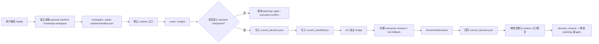

# 技术设计: 决策确认能力通用化（保持现有接入链路）

## 设计原则

本次设计不是重新发明一套 Sopify 接入方式，而是在现有 runtime / bundle / handoff 体系上升级 decision contract。核心原则如下：

1. 入口不变：默认 raw-input 入口继续是 `scripts/sopify_runtime.py`，vendored 默认入口继续是 `.sopify-runtime/scripts/sopify_runtime.py`。
2. bootstrap 不变：宿主仍通过全局 payload 的 `bootstrap_workspace.py` 按需补齐 `.sopify-runtime/`。
3. manifest-first 不变：workspace 内仍优先读取 `.sopify-runtime/manifest.json` 决定入口与能力。
4. handoff-first 不变：宿主仍先读取 `.sopify-skills/state/current_handoff.json` 判断下一步动作，再读取 decision state。
5. state file 不变：活跃决策仍然固化到 `.sopify-skills/state/current_decision.json`。
6. host action 稳定：`required_host_action` 继续保留 `confirm_decision`，避免一次性改动宿主入口语义。

## 当前基线与剩余增量

| 层 | 当前实现 | 剩余增量 |
| --- | --- | --- |
| 自动触发 | planning request 语义触发，识别显式分叉 + 架构关键词；已收口到 `decision_policy.py` | 保留现有触发作为基线，并为更强的 design-stage policy 预留 |
| 决策模型 | `DecisionState + DecisionCheckpoint + DecisionSubmission + legacy projection`；已接入 `decision_templates.py` | host bridge helper 已落地，下一步转向 design-stage tradeoff policy |
| 宿主动作 | `confirm_decision`，且 handoff 已暴露 `artifacts.decision_checkpoint` | 保持动作名不变，只继续扩展宿主桥接能力 |
| 宿主输入 | `1 / 2 / ~decide choose` + 结构化 submission 恢复 + 内置 interactive renderer | 继续扩 richer templates 与宿主产品接入 |
| state 文件 | `current_decision.json` 路径不变，结构已升级 | 保持路径稳定，完善 host write-back 约束 |
| UI 方案 | runtime 已统一 checkpoint schema，且 CLI interactive bridge 已落地 | 后续只继续扩 richer terminal UI 与宿主产品接入 |

## 总体架构



关键点是：宿主桥接只负责“渲染和采集”，真正的状态推进仍然回到默认 runtime 入口，不新增新的主入口脚本。

## Runtime Contract 设计

### 1. 状态文件保持原路径

活跃决策文件仍放在：

```text
.sopify-skills/state/current_decision.json
```

这样可以保证：

1. 宿主已有的读取路径不变。
2. handoff 中已有的 `decision_file` 指针不变。
3. 现有 bootstrap、bundle、manifest 逻辑无需改动。

### 2. 契约升级方向

当前实现已经采用“状态外壳 + checkpoint + submission”的升级方式，而不是直接替换成完全不同的独立对象。

建议结构如下：

```json
{
  "schema_version": "2",
  "decision_id": "decision_xxx",
  "phase": "design",
  "status": "pending",
  "decision_type": "strategy_pick",
  "summary": "需要在多个可执行方案之间收敛方向",
  "checkpoint": {
    "title": "方案方向确认",
    "message": "请确认当前方案方向",
    "fields": [],
    "recommendation": {}
  },
  "submission": {
    "status": "empty",
    "answers": {},
    "source": "",
    "submitted_at": null
  },
  "resume": {
    "route_name": "plan_only",
    "request_text": "~go plan ...",
    "requested_plan_level": "standard"
  },
  "legacy_projection": {
    "question": "xxx 还是 yyy",
    "options": [],
    "recommended_option_id": "option_1"
  }
}
```

当前实现继续遵守两个约束：

1. 新宿主优先读 `checkpoint / submission`。
2. 旧宿主仍可通过 `legacy_projection` 或兼容顶层字段继续处理单选场景。

### 3. 字段模型

当前 contract 已明确以下最小字段类型集合：

- `select`
- `multi_select`
- `confirm`
- `input`
- `textarea`

字段最小属性保持为：

- `field_id`
- `type`
- `label`
- `description`
- `required`
- `options`
- `default_value`
- `when`
- `validation`

`when` 的最小操作集维持为：

- `equals`
- `not_equals`
- `in`
- `not_in`

### 4. Submission 模型

宿主采集到的结果统一归一化为 `DecisionSubmission` 语义：

- `status`
- `source`
- `answers`
- `submitted_at`
- `resume_action`

runtime 已不再只靠原始文本解析判断用户意图，而是优先消费宿主写回的结构化 submission。

## Handoff Contract 设计

### 1. 动作名保持稳定

`required_host_action` 继续使用：

```text
confirm_decision
```

原因很直接：

1. 现有宿主文档、bundle 契约、README 都已经围绕 `confirm_decision` 建立了接入说明。
2. 如果仅为了“更通用”就切到新动作名，会把下一阶段本可兼容升级的事情做成宿主联动改造。

### 2. artifacts 升级为完整 checkpoint

旧版 handoff 主要提供：

- `decision_file`
- `decision_id`
- `decision_status`
- `decision_option_ids`
- `recommended_option_id`

当前 handoff 已升级为：

- `decision_checkpoint`
- `decision_submission_state`
- `decision_file`

宿主优先读取 `artifacts.decision_checkpoint`；如果 handoff 缺失该对象，再回退到 `current_decision.json`。

## 宿主桥接设计

### 统一桥接边界

无论宿主类型如何，桥接层都只做四件事：

1. 读取 handoff 与 checkpoint
2. 解析可见字段
3. 采集用户输入并归一化为 submission
4. 写回 `current_decision.json`，然后继续走默认 runtime 入口恢复

桥接层不应：

1. 自己决定恢复到哪个 route
2. 绕开默认 runtime 入口直接操作 planning / gate
3. 引入新的安装链路或 bundle 目录

### CLI 型宿主路径

当前文档范围内，CLI 型宿主是唯一需要收口的交互宿主。当前 repo 已提供内置 interactive renderer，但它仍然属于 CLI bridge 的实现细节，而不是新的接入前置条件：

- 默认：repo 内置 interactive renderer
- 可选扩展：宿主也可以对接等价终端问答库
- 最弱 fallback：纯文本问答，仍兼容 `1 / 2 / ~decide choose`

这条路径的核心要求是：

1. bridge 只是宿主实现细节，不进入 runtime machine contract。
2. 缺少库依赖时不能让 Sopify 失效，仍要能退回文本桥接。

## 当前执行顺序

当前这一轮已完成以下四块收口：

1. design-stage tradeoff policy
   `decision_policy.py` 已可优先消费 `RouteDecision.artifacts.decision_candidates`，并按“至少 2 个有效候选 + tradeoff 显著”触发统一 checkpoint。
2. replay 摘要增强
   推荐项、推荐理由、最终选择与关键约束已稳定写入 replay；自由输入默认不回放原文。
3. model-compare 统一协议评估
   `~compare` 已在 handoff 中输出 `compare_decision_contract` facade，宿主可复用同一套 decision bridge UI，但不改 compare 主路由。
4. analyze-stage scope clarify 模板
   `answer_questions` handoff 已可输出 `clarification_form / clarification_submission_state`，并支持通过 `clarification_bridge_runtime.py` 写回结构化补充信息。
这一轮完成后，下一步重点不再是重复造 bridge，而是继续补更强模板与 CLI 交互闭环：

1. 继续扩展更多非单选模板，并保持现有入口、manifest 与 handoff 契约不变
2. 收口 compare facade 的边界，而不是提前并入共享 state 主链路
3. 继续补宿主产品级接入，而不改变 repo 内统一 CLI bridge contract

## 蓝图同步要求

当前 plan 包之外，蓝图层至少要同步以下内容：

1. `blueprint/README.md`
   当前焦点应从泛化的宿主桥接表述切到“richer templates / compare facade boundary / host product integration”。
2. `blueprint/design.md`
   需要把旧的单选 decision 状态示例升级为 `checkpoint + submission + legacy projection`，并明确当前文档范围只收口 CLI 型宿主。
3. `blueprint/tasks.md`
   需要把“runtime 侧 decision contract 已完成”和“CLI interactive bridge 已落地、下一步转向 richer templates / compare facade”同步表达，避免把范围写散。

## Trigger Policy 迁移策略

当前实现已经进入“两阶段迁移”的第二层：保留 planning request 语义触发，同时支持结构化 tradeoff candidates。后续仍不建议一步切成纯 design-stage policy，而应继续渐进演化：

### 第一步

- 保留现有 planning 语义触发
- 在这个入口上引入通用 checkpoint / submission 契约
- 先把 CLI bridge 跑通

### 第二步

- 在 design 内部生成候选方案后，允许 policy 复用同一套 checkpoint 契约
- 把“是否需要用户拍板”从原始文本判断逐步迁移到方案 tradeoff 判断
- 对 compare 结果优先采用 handoff facade 复用统一 UI，而不是立即引入第二套 state 主链路

这样做的好处是：先稳定 contract 和 CLI bridge，再升级触发策略，减少一次性改动面。

## 恢复与兼容设计

### 1. 兼容旧版文本输入

对单选 checkpoint，仍应保留：

- `1 / 2 / ...`
- `~decide choose <option_id>`
- `~decide status`
- `~decide cancel`

这样可以让：

1. 旧宿主继续工作。
2. CLI 型宿主即使没有 richer bridge，也还能通过文本恢复。

### 2. 结构化 submission 恢复

对新宿主，runtime 应支持：

1. 宿主先把 submission 写回 `current_decision.json`
2. 宿主再通过既有默认 runtime 入口恢复
3. runtime 看到 submission 已齐备后直接进入 `decision_resume`

这里的重点是“恢复入口不变”，而不是让宿主去调用新的主脚本。

### 3. execution gate 兼容

当前 execution gate 已经依赖 plan metadata 中的 `decision_checkpoint.selected_option_id / status`。下一阶段应继续满足：

1. 对单选类 checkpoint，仍可投影出 `selected_option_id`
2. 对通用表单类 checkpoint，execution gate 只消费它真正需要的确认结果，不要求读取完整表单细节

## Manifest / Bundle 设计

manifest 只需要表达能力增强，不需要改变入口：

- `default_entry` 不变
- `plan_only_entry` 不变
- `handoff_file` 不变
- `decision_checkpoint` capability 保持为 `true`

如需新增宿主桥接能力描述，应追加在 capability 或 limits 中，不应破坏现有 bootstrap 判定条件。

## 成功判定

设计完成后，理想状态应是：

1. 用户继续按现有方式一键接入并在项目中触发 Sopify。
2. runtime 能输出兼容旧版与新版宿主的 decision contract。
3. CLI 型宿主能稳定渲染并恢复决策交互。
4. 恢复链路仍然统一回到默认 runtime 入口，不新增必须记忆的新主入口。
