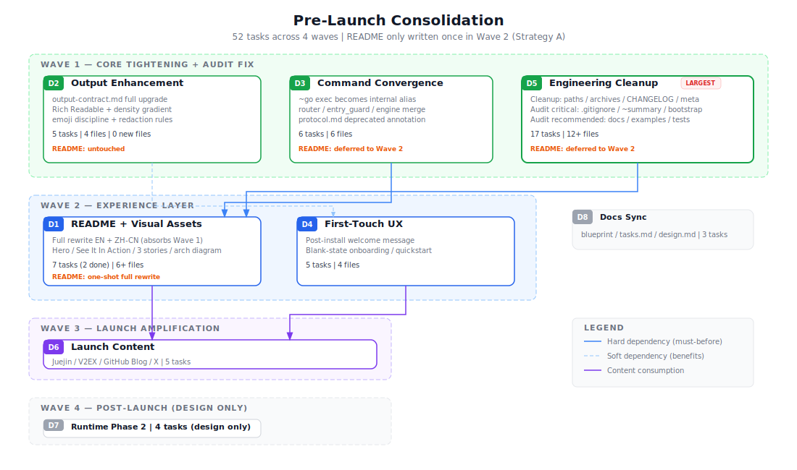

# 技术设计: 推广前大收口整合

## 方向总览与依赖关系



4 个执行波次：Wave 1（内核收口：D2 + D3 + D5）→ Wave 2（体验层：D1 + D4）→ Wave 3（推广放大：D6）→ Wave 4（内部质量：D7）。

D1-D5 可较大程度并行；D6 依赖 D1/D4 产出（截图 / 体验流）；D7 完全独立。

## Sopify 简化架构参考


三层结构：Host Layer → Core Protocol（ActionProposal → Validator → Receipt → Handoff）→ Knowledge Layer（Blueprint / Plan / History / project.md）。Validator 是唯一授权者，Host LLM 只是 proposal source。

---

## D1: README 重写与视觉资产升级

> Wave 2 执行。吸收 Wave 1 中 D3/D5 产生的所有 README 变更需求。

### 技术方案

**README 结构重组（EN + ZH-CN 双语同步）：**

```
Hero Section (精简)
├── Logo + 一句话 slogan + badge
├── Cover 图（场景图：Start → Pause → Resume 跨宿主）
└── 语言切换 + Quick Start 锚点

"See It In Action" Section (新增)
├── 真实截图或 GIF：一个完整的 ~go 工作流
└── 3 步体验描述（替代当前文字表格）

Quick Start (保持简洁)
├── One-liner install
└── 首次使用提示

Why Sopify (改写)
├── 3 个故事场景替代 4 格 gap/answer 表
│   ├── 场景 1: 跨宿主接力（"周一用 Claude 开始，周二用 Copilot 继续"）
│   ├── 场景 2: 决策可追溯（"为什么当时选了方案 B？"）
│   └── 场景 3: 独立质量闭环（"提交前的隔离审查"）
└── 简短对比定位（一段话，不做攻击性对比）

Architecture (简化)
├── 3 层图：Protocol → Validator → Knowledge
└── 一段话解释

Installation (保持)
Command Reference (精简，删 ~go exec)
Directory Structure (保持)
FAQ (收进 docs/，README 只留 2-3 条)
```

**视觉资产升级：**

| 资产 | 当前状态 | 目标 |
|------|---------|------|
| `sopify-cover.jpg` | 静态概念图 | 场景图：展示跨宿主工作流（D1 4.5） |
| `sopify-architecture.svg` | 密度高，层级多 | 简化为 3 层，降低认知门槛（D1 4.6） |
| `sopify-workflow-cn/en.jpg` | 流程图 JPG（how-sopify-works 用） | tech-graph 重画为 SVG（gate → routing → handoff） |
| `sopify-checkpoint-cn/en.jpg` | 状态图 JPG | tech-graph 重画为 SVG（两种 checkpoint 模式） |
| `sopify-plan-lifecycle-cn/en.jpg` | 生命周期图 JPG | tech-graph 重画为 SVG（plan 阶段流） |
| `sopify-harness-cn/en.jpg` | 概念映射图 JPG | tech-graph 重画为 SVG（Harness → Sopify 对比） |
| 新增 | — | "See It In Action" GIF 或系列截图 |

### 安全与性能

- 安全: 截图中不暴露真实项目代码/路径
- 性能: 图片压缩到合理大小（cover < 500KB, GIF < 2MB）

---

## D2: 输出增强系统（Rich Readable Output）

> Wave 1 执行。

### 设计哲学

**规则驱动，不堆模板。** 新增输出能力通过升级 `output-contract.md` 条款实现，不新建独立模板文件。模板文件只保留现有 5 个（analyze × 2, develop × 3），新场景靠 §3 触发条件匹配。

参考 Claude skill 规范的渐进披露：基础规则所有宿主都遵守，增强条款仅在触发条件匹配时激活。

### 技术方案

**`output-contract.md` 整体升级：**

```
§1 输出路径说明（保持原有，补充 gate 排除 Rich Readable 条款）
§2 必需 section 契约（保持原有）
§3 Conditional Enhancement（整体升级）
  ├── 原有触发条件（保持）
  ├── Rich Readable 允许层
  │   ├── 排版辅助（emoji header / checkbox / bold / 代码块）≠ 主结构，不受限
  │   └── 对比表格 / 树 / 编号序列仍受主结构约束
  ├── 交付物增强条款
  │   └── 文件变更 ≥ 2 时：可采用分段叙事（概述 + 文件表 + 逻辑 + 验证）
  ├── 发现报告条款
  │   └── 审计/review 发现：按严重级别分组 + 固定字段（# / 问题 / 位置 / 建议）
  ├── 密度梯度
  │   ├── gate/routing → 极简（机器可预测）
  │   ├── quick-fix → 简洁（改了什么 + 验证）
  │   ├── delivery → 丰富（分段叙事）
  │   ├── findings → 结构化（分级表）
  │   └── consult → 自适应（匹配问题复杂度）
  ├── Emoji 纪律
  │   ├── 允许：section header / 严重级别标记
  │   └── 禁止：每行 bullet 都加 / 纯装饰
  └── Markdown 表格默认（不用 box-drawing，CJK 对齐问题）
§4 输出前自检（保持原有）
§5 脱敏规则（新增）
  ├── 绝对路径默认脱敏（替换为相对路径或 <workspace>）
  ├── 用户名 / 主机名默认脱敏
  └── token / 密钥 / API key 严禁明文输出
```

**变更文件（不新增模板文件）：**

| 文件 | 变更类型 | 说明 |
|------|---------|------|
| `skills/zh/skills/sopify/references/output-contract.md` | 修改 | §1 补充 gate 排除、§3 整体升级、新增 §5 脱敏 |
| `skills/en/skills/sopify/references/output-contract.md` | 修改 | EN 同步 |
| `skills/zh/skills/sopify/develop/SKILL.md` | 修改 | 输出选择逻辑引用更新后的 §3 条款 |
| `skills/en/skills/sopify/develop/SKILL.md` | 修改 | EN 同步 |

### 边界

- 不新增模板文件，不替代现有 5 个模板
- 交付物/发现报告增强靠 §3 条款触发，不是独立模板选择
- 宿主本身输出质量已高时，保持宿主输出，仅补齐 contract 必需 section
- Gate/routing 输出严格保持极简，不适用 Rich Readable

---

## D3: 命令面收敛（~go exec 直接移除）

> Wave 1 执行。README 变更推迟到 Wave 2 D1。

### 技术方案

**收敛策略：直接移除 `~go exec` 用户命令，`~go` 吸收活动 plan 自动检测**

```
用户输入 ~go
  → router 检测是否存在活动 plan
  ├─ 有活动 plan + 有待执行任务 → 自动路由到 exec_plan（内部路由名保留）
  ├─ 有活动 plan + 全部完成 → 提示 finalize
  └─ 无活动 plan → 正常 workflow（analyze → design → develop）
```

**Runtime 变更：**

| 文件 | 变更 |
|------|------|
| `runtime/router.py` | 删除 `~go exec` regex（L18）及相关路由逻辑，`~go` 增加活动 plan 检测 |
| `runtime/entry_guard.py` | bypass 列表移除 `~go exec` 条目 |
| `runtime/engine.py` | `exec_plan` 路由名保留，不再由独立命令触发 |

> 注：`exec_plan` 作为内部路由名在 11 个文件中使用（handoff / gate / _planning / _orchestration / context_snapshot / output / manifest / builtin_catalog），本轮不改动。

**文档变更：**

| 文件 | 变更 |
|------|------|
| `README.md` / `README.zh-CN.md` | 命令表删除 `~go exec` — **推迟到 Wave 2 D1** |
| `.sopify-skills/blueprint/protocol.md` | `~go exec` 标注已移除，`~go` 自动检测活动 plan |
| `skills/*/skills/sopify/develop/SKILL.md` | 激活条件从 `exec_plan` 改为 `workflow + active_plan` |

---

## D4: 首次触达链路优化

> Wave 2 执行。

### 技术方案

**当前链路：** `install.sh → 安装完成 → 用户自行输入 ~go → 开始工作`

**优化后链路：**

```
install.sh → 安装完成
  → 输出欢迎信息（含推荐首次操作 + 项目当前状态摘要）
  → 用户输入推荐操作
  → 立刻看到 Sopify 的价值（分析 + 方案 + 知识沉淀）
```

**改造点：**
1. `install.sh` / `bootstrap.sh` 末尾增加结构化欢迎信息
2. Skill prompt 层检测 `.sopify-skills/` 空白状态时输出首次引导
3. `examples/external-repo-quickstart/` 补充端到端截图和预期输出

---

## D5: 发布前工程收口

> Wave 1 执行。README 相关编辑推迟到 Wave 2 D1。

### 原有清理项

| 项目 | 当前状态 | 目标 |
|------|---------|------|
| `project.md` 绝对路径 | 含 `/Users/weixin.li/...` | 清理为相对路径或占位符 |
| `skill-standards-refactor.md` | "专项归档候选"悬空在 blueprint/ | 归档到 history/ 或合并到 design.md |
| CHANGELOG.md | 偏 commit log 风格 | 撰写人类可读的 release note |
| `_registry.yaml` | plan/ 下遗留 | 清理不再活跃的条目 |
| GitHub repo metadata | 未设置 | description / topics / social preview |
| copilot target 状态 | 过时描述 | **推迟到 Wave 2 D1 统一重写** |
| docs 命令引用 | 含 `~go exec` | **推迟到 Wave 2 D1 统一处理** |

### 审计驱动修复项

**🔴 阻断级（投放前必修）：**

| 项目 | 位置 | 修复方案 |
|------|------|---------|
| .gitignore 补全 | `.gitignore` | 添加 `.env`、`.venv/`、`dist/`、`build/`、`.claude/settings.local.json` |
| 已追踪本地配置清理 | `.claude/settings.local.json` | `git rm --cached` 取消追踪 + .gitignore 覆盖 |
| `~summary` 残留 regex | `installer/bootstrap_workspace.py:450` | 删除该 regex 行（`~summary` 在 P1.5 已全链路删除） |
| `bootstrap.sh` init 参数 | `bootstrap.sh:9-15,72-83` | 移除 help 中的 init 描述，或实际接入 init 逻辑 |

**🟡 建议级（推广前应修）：**

| 项目 | 位置 | 修复方案 |
|------|------|---------|
| `sopify_init.py` docstring 缺参数 | `scripts/sopify_init.py:1-11` | 补全 `--no-copilot`、`--language` 参数说明 |
| external-repo-quickstart 路径错误 | `examples/external-repo-quickstart/README.md:59-67` | 修正 `.github/instructions/sopify.instructions.md` 为实际路径 |
| `install.sh` python 回退 | `install.sh:153-157` | 添加 `python`/`py` 回退链（`install.ps1` 已有回退） |
| `examples/sopify.config.yaml` 不完整 | `examples/sopify.config.yaml` | 补全 `advanced.kb_init` 等实际支持的配置项 |
| `CONTRIBUTING.md` 旧脚本引用 | `CONTRIBUTING.md:50-80` | 更新 `scripts/install-sopify.sh` 引用为当前入口 |
| `~compare` 测试断言 | `tests/test_action_intent.py:353,370` | 降级为 legacy 语义清理（删除或改写断言） |
| test fixture 绝对路径 | `tests/fixtures/p4d_smoke/current_gate_receipt.json` | 替换为相对路径或 `__WORKSPACE__` 占位符 |

---

## D6: 推广内容矩阵

> Wave 3 执行。依赖 D1/D4 产出。

### 技术方案

| 平台 | 语言 | 文章风格 | 标题方向 | 优先级 |
|------|------|---------|---------|--------|
| 掘金 | ZH | 技术实战 + 原理 | "AI 编程的失忆症——我如何用 Sopify 解决" | P0 |
| V2EX | ZH | 社区讨论 | "AI 编程的 3 个隐藏问题" | P1 |
| GitHub Blog | EN | 技术深度 | "Beyond chat: resumable AI coding" | P1 |
| 即刻/X | ZH/EN | 短内容引流 | 截图 + 一句话 + 链接 | P0 |

**掘金主文结构：**

```
1. Hook: AI 编程的"失忆症"—— 每次对话都从零开始
2. 问题拆解:
   - 决策不可追溯（上次为什么选了方案 B？找不到了）
   - 上下文断裂（换个工具 = 从头再来）
   - 质量不可验证（"应该没问题"不是证据）
3. Sopify 如何解决（with 真实截图/GIF）
   - 5 分钟上手体验（install → ~go → 看到产出）
   - 跨宿主接力演示
   - 独立审查演示
4. 架构一页图 + 核心概念
5. 与其他工具的定位差异（互补视角，不做攻击性对比）
6. 上手链接 + 社区入口
```

**协作模式：** 我产出完整草稿 → 你审阅修改 → 你发布

---

## D7: Runtime Phase 2 收缩

> Wave 4 执行。仅出方案，不执行。

### 技术方案

当前状态：runtime/ 41 文件 / 16,324 LOC。Phase 1 已完成（-6,400 LOC）。

**Phase 2 目标：**

```
installer 5 文件解耦
  ├── validate.py — 去除 runtime import 依赖
  ├── bootstrap_workspace.py — 改用 canonical_writer
  ├── inspection.py — 独立化
  ├── install_sopify.py — 走 sopify_contracts 路径
  └── sopify_init.py — 走 sopify_contracts 路径

runtime/ 降级
  ├── 标注 deprecated（README + 目录 README）
  ├── 从安装链路移除（install.sh 不再 copy runtime/）
  └── 保留为 reference implementation（git history）
```

本方案包不执行 D7 实施。

### 安全与性能

- 安全: D3 命令面收敛不破坏现有 `~go` 行为（alias 保持向后兼容）
- 性能: D2 输出增强不增加 prompt token 消耗（模板层变更）；D1 图片资产控制大小
