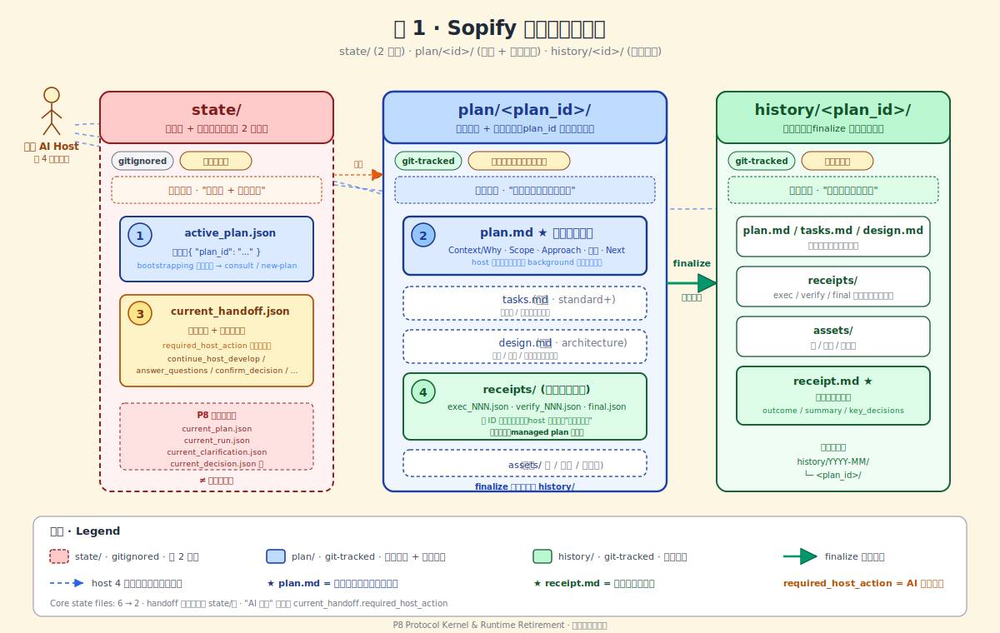
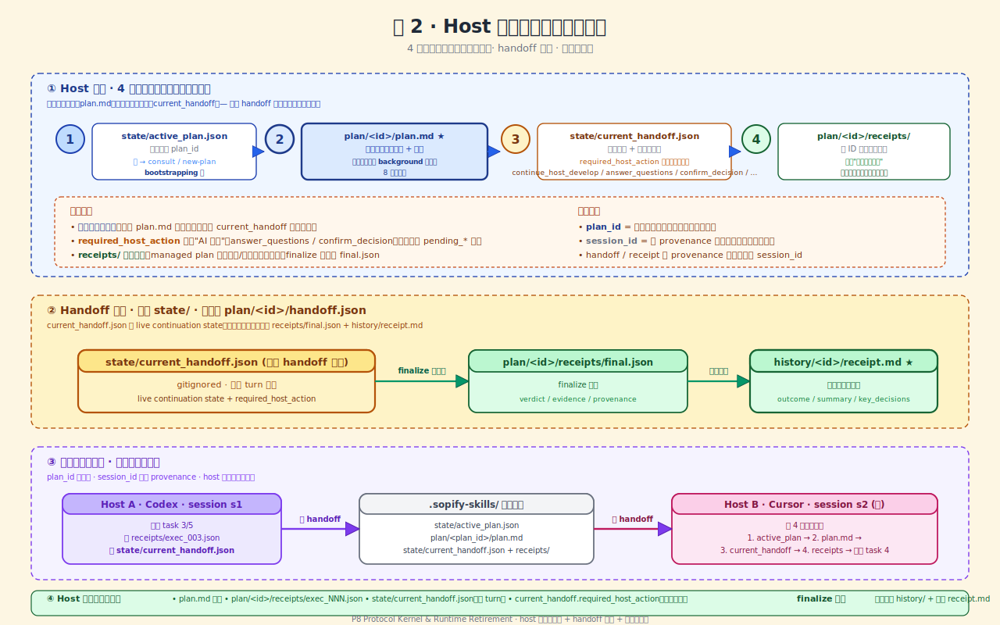

# Design

## 1. 产品定位

**P8 目标态**：Sopify 从"有 runtime 的工作流系统"变成 **AI coding 工具可消费的审计资产协议内核**。

Sopify 不只保存代码结果，而是把 AI 开发过程中的方案、决策、交接、执行/验证证据和归档结论沉淀为可追溯资产。跨宿主接续是这些资产可携带、可验证后的结果，不是 P8 的全部产品叙事。

P8 后 Sopify 不是只剩一份协议文档，而是三层收口：

| Layer | P8 后角色 | 边界 |
|---|---|---|
| Protocol kernel | protocol.md + schemas + sopify_writer + compliance/doctor/read-only inspection | 承载 truth/evidence；定义 host 读写协议和可审计资产 |
| Default workflow | analyze / design / develop / kb / templates 等默认流程与 prompt/skill 资产 | 承载产品体验；消费 protocol assets，不再拥有 runtime machine truth |
| Skills / host adapters | Qoder/Copilot 等 host payload、开发 skill、验证/诊断工具 | 承载具体宿主和能力接入；必须服从 protocol kernel 的写入边界 |

- **runtime/ 物理删除**：不再有 runtime router / engine / session state machine / 每轮必跑 gate
- **protocol kernel 留下**：init/bootstrap、validate/compliance、doctor/smoke + writer library，体量保持小
- **真相源切换**：从 runtime 切换到 protocol.md + sopify_writer + sopify_contracts
- **registry 退场**：`plan/_registry.yaml` 不再作为机器治理层保留；多 plan backlog 如需重做，必须是 human-readable index，不进 P8 内核

**Protocol kernel 不是 runtime 复活**：只允许 init/bootstrap、validate/compliance、doctor/read-only inspection 与 writer library。不允许 router/engine/session state machine 回流。

**Runtime 退场不是 workflow / skills 退场**：P8 删除的是 runtime 承担的强路由、状态机和 gate-first 义务；默认工作流和开发 skill 继续存在，但只能把 protocol assets 当真相源，并通过 sopify_writer 写回 state/receipts。

**ActionProposal 保留为工作流层概念**：它用于 host/default workflow 做请求准入与分发，不再是 `runtime_gate.py` 的输入，也不进入 P8 5 件 must-freeze。P8 不冻结完整 ActionProposal schema，只要求宿主先判断用户请求意图，再决定是否进入接续读链。

**P8 不是**：

- 不是 protocol.md v1 全面发布（只 freeze 5 件 must-freeze，draft 保留为 draft）
- 不是新主轴（挂在 P5/P6/P7 收口主线上）
- 不是多宿主扩展（只做 Qoder 1 个试点作为验收；Cursor / Windsurf 放后续）
- 不是默认工作流或开发 skill 退场

## 2. 协议内核（Kernel）— 5 件 Must-Freeze

| # | Contract | 文件 | Schema 要点 |
|---|---|---|---|
| 1 | Active Plan Pointer | `state/active_plan.json` | `{ "plan_id": "<id>" }`；极简 |
| 2 | Current Handoff | `state/current_handoff.json` | 复用蓝图已定义 handoff schema + `required_host_action` 字段（复用蓝图 canonical 值：`continue_host_develop` / `answer_questions` / `confirm_decision` / `continue_host_consult` / `resolve_state_conflict`）（schema cutover 见 §4.6） |
| 3 | Plan.md Required Sections | `plan/<id>/plan.md` | 8 必备章节：Context/Why / Scope / Approach / Waves / Key Decisions / Constraints / Status / Next |
| 4 | Plan Receipts | `plan/<id>/receipts/*.json` | 命名规范 `exec_NNN / verify_NNN / final`；字段：verdict / evidence / provenance / timestamp |
| 5 | History Receipt | `history/<id>/receipt.md` | 必备章节：outcome / summary / key_decisions |

**明确不冻结 / 明确退场**：

- pending_* 文件（已删除；折叠到 current_handoff.required_host_action）
- last_archive_receipt（已删除；归档事实进 history/receipt.md）
- plan/<id>/handoff.json（不新造；最后交接事实体现在 receipts/final.json + history/receipt.md）
- Integration Contract 中的 Producer / Knowledge Provider（仅 Verifier 升格）
- Multi-host review contract / Plugin admission（延后）
- GateReceipt / deep runtime gate（legacy/deep 迁移对象，不进 P8 新核心；P8 中显式 retire）
- ExecutionAuthorizationReceipt（pre-execution runtime-gate 授权模型产物；P8 中显式 retire，不迁入 protocol kernel）
- `plan/_registry.yaml`（P8 删除；不是 host 接续入口，不保留 optional observe-only）

## 3. Plan Package Structure（方案包结构）

### 3.1 文件清单

```
plan/<plan_id>/
├── plan.md              # 必备，唯一语义入口（含 Context/Why）
├── tasks.md             # 可选（standard+ 级）
├── design.md            # 可选（architecture 级）
├── receipts/            # 必备，过程审计资产
│   ├── exec_NNN.json    # 执行凭证
│   ├── verify_NNN.json  # 验证凭证
│   └── final.json       # finalize 凭证
└── assets/              # 可选，图、截图、长参考材料
```

### 3.2 分级（Progressive Disclosure）

| 级 | 必备文件 | 适用场景 |
|---|---|---|
| **light** | plan.md | 小任务、单步修复、探索性提案 |
| **standard** | plan.md + tasks.md | 多任务、需逐项验收 |
| **architecture** | plan.md + design.md + tasks.md + receipts/ + assets/ | 架构级、协议级、状态模型变更 |

### 3.3 plan.md 结构：Plan Snapshot + 8 必备章节

每个 plan.md 顶部推荐有 **Plan Snapshot** 区块，然后是 8 必备章节（顺序固定）。Plan Snapshot 缺失不阻断审计和接续；host 必须回退读取完整 plan.md。

**Plan Snapshot（推荐轻量入口，LLM 默认只读此区；内部 schema 字段名为可选的 `plan_snapshot`）**：

```markdown
## Plan Snapshot

- **Goal**: [1-2 行，当前目标]
- **Status**: [pending / in_progress / done / blocked]
- **Next**: [下一步动作]
- **Task**: [当前 wave / task 指针，如 "W1.1 Freeze 5 Must-Freeze Schemas"]
```

Plan Snapshot 是 LLM 的默认读取窗口——host 每轮读 plan.md 时优先读此区，不读完整文件。它同时是用户打开 plan.md 时第一眼看到的当前状态快照。只有缺失、与正文/receipts 冲突、需要评审方案、执行任务或状态冲突时，才展开读完整 plan.md → tasks.md → design.md → assets。

**边界**：Plan Snapshot 不是目录索引、不是 `_registry.yaml` 替代品、不是新的 state 文件，也不是权威审计事实。它只是 plan.md 正文顶部的用户可读状态快照和接续入口摘要，帮助 host/LLM 在低 token 预算下知道"当前目标、状态、下一步、任务指针"。若与正文、tasks 或 receipts 冲突，以正文和 receipts 为准。

**8 必备章节**（Plan Snapshot 之后）：

1. **Context / Why**：触发条件、输入来源、为什么新包、为什么不做 X
2. **Scope**：做什么
3. **Approach**：怎么做
4. **Waves / Steps**：分几步
5. **Key Decisions**：关键决策（引用 design.md 章节）
6. **Constraints / Not-in-scope**：硬约束 + 延后项
7. **Status / Progress**：当前进度（任务多时拆到 tasks.md）
8. **Next**：下一步动作

plan.md 承担原 background.md 职责（Context/Why），不单独拆 background.md。

### 3.4 规则

- plan.md 是**唯一语义入口**
- tasks.md 可选；任务多、依赖复杂、需逐项验收时拆出
- design.md 可选；仅架构级、协议级、跨模块、状态模型、重大取舍时才有
- receipts/ **条件必备**（过程审计资产）：managed plan 产生执行/验证事件时必须写到 `receipts/*.json`；finalize 时必须生成 `receipts/final.json`；light plan 如无 managed execution 可无 receipts/。命名规范 `exec_NNN / verify_NNN / final`
- assets/ 可选；放架构图、PNG/SVG、长参考材料（**不拆 references/**）
- **不加** status.json（与 plan.md 重复，over-design）
- **不加** plan-level README.md（与 plan.md 职责冲突）
- **不加** plan/<id>/handoff.json（handoff 单态，只在 state/；最后交接事实体现在 receipts/final.json + history/receipt.md）
- **不加 / 不保留** `_registry.yaml`（当前 machine registry 对用户不可读，对 host 接续不必要；P8 删除）

## 4. State Model（状态模型）— 极简 2 文件

### 4.1 三层硬区分

| 层 | 用户心智 | Git | 职责 |
|---|---|---|---|
| **state/** | 定位针 + 恢复提示 | ignored | 帮新宿主定位 plan、知道上次停哪、知道是否等用户 |
| **plan/<id>/** | 这件事本身 + 过程审计资产 | tracked | 方案、任务、决策、凭证、可选设计 |
| **history/<id>/** | 最终档案 | tracked | finalize 后的完整可审计记录 |

### 4.2 state/ 最小集合（2 文件）

```
state/
├── active_plan.json        # 定位：{ "plan_id": "<id>" }
└── current_handoff.json    # 恢复：复用蓝图 handoff schema + required_host_action
```

**全部 gitignored，可重建**。state/ 不能成为长期事实源。

### 4.2b blueprint persistence_red_line 收口要求

当前 blueprint keep-list 把 pre-P8 的 `state/current_run`、`current_plan`、`current_handoff`、`current_clarification`、`current_decision` 列为 `persistence_red_line`。P8 不是绕过这条红线，而是**显式重写红线本身**：

- `current_plan` → `active_plan.json`
- `current_run` → 下沉到 `plan/<id>/plan.md` 的 Status / Next 正文
- `current_clarification` / `current_decision` → 下沉到 `current_handoff.required_host_action` + `artifacts`
- `current_handoff` → 保留，但 schema 收敛为 post-P8 continuation model

因此，W1/W3 必须同步更新 blueprint/design.md 的 `persistence_red_line` 与 keep-list，不能只改 protocol.md 或实现层。

### 4.3 Registry 退场

`plan/_registry.yaml` 在 P8 中直接删除，不降级为 optional observe-only。

**理由**：

- 它不是 host 接续锚点；host 只需要 `active_plan.json` 定位当前 plan。
- 它不是用户可读资产；当前 priority/advice/governance 结构对用户价值弱。
- 它会让 P8 叙事从"协议文件即可接续"偏回"内部机器治理索引"。
- 当前线上用户少，接受直接删除带来的兼容破坏。

**删除范围**：

- `runtime/plan/registry.py`
- registry upsert / inspect / recommend 调用链
- `_registry.yaml` backfill / reconcile / priority note 输出
- registry 相关测试与 golden snapshot
- docs 中 `_registry.yaml` 描述

**后续选择**：如果未来需要多 plan backlog，另做 `plan/index.md` 或 `blueprint/tasks.md` 风格的 human-readable index，不复用 `_registry.yaml`。

### 4.4 删除的 state 文件（P8 显式删除）

| 旧文件 | 处置 |
|---|---|
| `state/current_plan.json` | **删除** → 被 `active_plan.json` 替代 |
| `state/current_run.json` | **删除** → 语义下沉到 `plan/<id>/plan.md` 的 Status 章节 |
| `state/current_clarification.json` | **删除** → 折叠到 `current_handoff.required_host_action = answer_questions` |
| `state/current_decision.json` | **删除** → 折叠到 `current_handoff.required_host_action = confirm_decision` |
| `state/current_archive_receipt.json` | **删除** → 真相进 `history/<id>/receipt.md` |
| `state/last_route.json` | **删除** → 可从 current_handoff 派生 |

### 4.5 "AI 等人"信号折叠到 current_handoff

**复用蓝图已定义的 canonical required_host_action**，不新增字段：

| 场景 | current_handoff.required_host_action | 备注 |
|---|---|---|
| AI 继续工作 | `continue_host_develop` | 默认 |
| AI 等用户补事实 | `answer_questions` | 替代原 pending_clarification |
| AI 等用户拍板 | `confirm_decision` | 替代原 pending_decision |
| AI 等用户继续对话 | `continue_host_consult` | |
| AI 完成可 finalize | finalize hint 体现在 handoff.notes | |
| AI 空闲 | idle 体现在 handoff.notes | |

问题列表 / 选项内容放在 `current_handoff.artifacts` 或 `current_handoff.notes` 字段，复用蓝图已定义 schema。

### 4.6 current_handoff schema cutover（显式字段边界）

P8 的 `current_handoff.schema.json` 是 **strict schema**（`additionalProperties: false`），所以字段收敛必须显式定义，不能靠实现层隐式删除。

| 字段 | P8 后状态 | 说明 |
|---|---|---|
| `schema_version` | required | 保留 |
| `plan_id` | required | 新增；替代 `route_name`/`run_id` 作为接续主键 |
| `required_host_action` | required | 保留 |
| `plan_path` | optional / 推荐保留 | 宿主便利字段 |
| `artifacts` | optional / 推荐保留 | 问题 / 选项内容 |
| `notes` | optional / 推荐保留 | 自由文本 |
| `observability` | optional / 推荐保留 | 可观测性字段 |
| `route_name` | retired from required | runtime provenance；如有残留价值，只能以 optional provenance 字段存在，不可重回 required |
| `run_id` | retired from required | runtime provenance；同上 |
| `handoff_kind` | retired from required | 如有残留价值，只能以 optional provenance 字段存在，不可重回 required |
| `resolution_id` | retired from required | 同上 |

W1.1 必须把 schema required 集与字段对照写实；W2.4/W2.5 只是在实现层消费该 cutover，不负责再定义字段语义。

### 4.7 ExecutionAuthorizationReceipt / current_gate_receipt 的处置

P8 采用的不是“把 EAR 迁移到新文件”，而是**退场 pre-execution authorization model**。

| 维度 | Pre-P8 | Post-P8 |
|---|---|---|
| 审计时机 | 执行前（runtime gate 生成 EAR） | 执行后（receipts 证据链）|
| 审计产物 | `ExecutionAuthorizationReceipt` / `current_gate_receipt` | `plan/<id>/receipts/*.json` + `history/<id>/receipt.md` |
| 写入/校验边界 | runtime gate 进程 + EAR 生成 | `sopify_writer` + compliance smoke |
| 宿主依赖 | 必须调用 `runtime_gate.py` | 只需读写 protocol 文件 |
| P8 处置 | 显式 retire，不迁移 | 新审计主链 |

这不是 EAR 的"同义替代"，而是产品承诺切换：从 **pre-execution authorization proof** 切到 **post-execution evidence chain**。

原因：

- ExecutionAuthorizationReceipt 的核心语义是 **runtime gate 在执行前生成的机器授权回执**
- P8 删除 runtime gate 后，不再存在一个稳定的"执行前授权时刻"
- 强行保留 EAR 只会留下空壳兼容层，反而把 protocol kernel 再次拖回 runtime 语义

## 5. Handoff 单态

**之前讨论的 handoff 双态（live in state/ + settled in plan/ + archived in history/）是过度设计**。

**最终设计：handoff 单态**：

- `state/current_handoff.json` 是**唯一 handoff 文件**，gitignored，每次 turn 重写
- finalize 时**不 promote 到 plan/<id>/handoff.json**
- 最后交接事实体现在：
  - `plan/<id>/receipts/final.json`（finalize 凭证）
  - `history/<id>/receipt.md`（最终审计收据）

**理由**：

- plan/<id>/ 已经有 receipts/ 作为过程审计资产，handoff 是"live 状态"不是"审计事实"，不应进 plan scope
- 跨宿主接续只需要 state/current_handoff.json（live cache）+ plan/<id>/plan.md（语义真相）
- 审计追溯靠 history/<id>/receipt.md + receipts/，不需要 handoff.json

## 6. 接续逻辑（Continuation Logic）

**架构图（手绘风格）**：

-  — state/ 2 文件 + plan/<id>/ 方案本体 + history/<id>/ 归档档案 + host 4 步入口读顺序
-  — host 4 步入口读顺序详解 + handoff 单态 + 跨宿主接续场景

> 浏览器直接打开 SVG 可看完整标注；GitHub / IDE markdown preview 通常也能渲染。

### 6.1 Request Admission Before Continuation

P8 后 host 每轮先做 **runtime-independent ActionProposal**：识别用户请求属于 consult / quick_fix / new_plan / continue_plan / finalize / ask_user / 其他 host-supported action。这个判断发生在接续读链之前，避免把所有请求都强行解释成"继续 active_plan"。

| 用户意图 / ActionProposal | Host 行为 |
|---|---|
| 问问题、澄清、解释、代码阅读 | consult；默认不读取 active_plan 接续链，必要时只读 blueprint/project 轻上下文 |
| 明确说继续当前/上次 plan，或命令语义等价于 continue | 执行 4 步 protocol entry：active_plan → plan.md → current_handoff → receipts |
| 当前 active_plan 的 `required_host_action` 等用户回答/确认 | 读取 handoff 后只响应等待项，不静默推进 |
| 临时 quick fix，且用户未要求审计/跨宿主接续 | 可 unmanaged 执行；不切 active_plan，不强制写 receipts |
| 风险高、多文件、跨模块、用户要求审计或需要跨宿主接续的新工作 | 创建 light/standard/architecture managed plan；如已有 active_plan，先确认是切换、合并还是暂停 |
| finalize / 归档 | 进入 finalize 工作流，读取 active_plan/plan/receipts，写 final receipt + history |

**边界**：ActionProposal 是 host/prompt/default workflow 层的 admission 结果，不是新的 protocol state 文件，不新增 must-freeze schema，不复活 runtime router。协议内核只约束：一旦进入 managed plan 或 continuation，读写必须遵守 protocol entry 与 sopify_writer 边界。

### 6.2 Host 入口读顺序（4 步）

P8 的入口不再是 `runtime_gate.py enter`，而是 **Host Protocol Entry Contract**。protocol.md §8 在 W1.2 中应整体替换为这一新入口契约，只保留一行 retirement note 指向 pre-P8 deep runtime gate 的历史背景，不保留整段旧 gate-first 正文。

| 项 | Contract |
|---|---|
| 触发者 | host prompt asset / Sopify instruction |
| 触发条件 | workspace 存在 `.sopify-skills/sopify.json` 或 `.sopify-skills/`，且 ActionProposal 指向 managed plan / continuation / finalize |
| 触发时机 | 新 session 且用户请求需要接续；用户明确继续未完成工作前；managed plan 写回前 |
| 必读文件 | active_plan → plan.md → current_handoff → receipts |
| 禁止 | 不读 `_registry.yaml`；不调用 runtime gate；不自行写 state/receipt |
| 写回 | 只能通过 `sopify_writer` 写 state/receipt |
| 读取预算 | 默认只读小入口；长文档按需读取 |

prompt asset 只承担"让 LLM 先做 request admission，并在需要时进入 protocol entry"的职责；protocol.md 承担入口顺序与 fail-open/fail-closed 规则；`sopify_writer` 承担写入约束。三者组合替代 runtime gate，但不复刻 runtime router，也不保留 ExecutionAuthorizationReceipt / current_gate_receipt 这一套 pre-execution gate artifact。

```
1. state/active_plan.json         → 定位 plan_id（如无 → consult / new-plan）
2. plan/<id>/plan.md              → 语义入口：做什么 + 进度（真相源）
3. state/current_handoff.json     → 恢复提示 + 是否等用户（required_host_action）
4. plan/<id>/receipts/            → 取最新 1-3 个 receipt，知道"哪些被验证过"
```

**顺序设计原则**：active_plan 定位后**先读 plan.md 建立语义真相**，再读 current_handoff 作为恢复提示——**避免 handoff 反过来变成第二真相源**。

### 6.3 Host Protocol Entry Read Budget

P8 的用户接受度取决于入口是否轻。Host 每轮必须先做 request admission；只有进入 managed plan / continuation / finalize 时才执行 protocol entry，且不能把所有文档塞进上下文。

| 资产 | 默认读取 | 何时扩展读取 |
|---|---|---|
| `state/active_plan.json` | 全量；应只有 plan_id | 进入 managed plan / continuation / finalize 时读 |
| `state/current_handoff.json` | 全量；必须保持短小 | 进入 managed plan / continuation / finalize，且 active_plan 存在时读 |
| `plan/<id>/plan.md` | 优先读 Plan Snapshot 区（Goal / Status / Next / Task）；缺失则读完整 plan.md | 需要评审方案、执行任务、或状态冲突时展开读完整 plan.md → tasks.md → design.md → assets |
| `plan/<id>/tasks.md` | 默认不读；仅当 plan.md 指向当前任务时读相关段落 | 执行 standard/architecture 任务时 |
| `plan/<id>/design.md` | 默认不读 | 架构取舍、接口/schema、风险判断需要时 |
| `plan/<id>/receipts/` | 最新 1-3 个 receipt，或 `final.json` | 审计、回滚、争议定位时读取更多 |
| `assets/` | 默认不读 | 当前任务明确需要图、截图、长参考时 |
| `blueprint/protocol.md` | 默认不全量读；host prompt 已携带入口摘要 | 协议实现、合规检查、宿主适配时 |

**预算规则**：

- prompt asset 不内联 protocol.md 全文，只内联 Host Protocol Entry 摘要。
- plan.md 顶部推荐有 Plan Snapshot 区块（Goal / Status / Next / Task），host 默认只读此区；缺失或冲突时回退完整 plan.md，避免每轮读完整设计但不牺牲审计正确性。
- receipts 必须可按 timestamp/receipt_id 找到最新，不要求全量扫描内容。
- compliance smoke 必须检查 prompt/protocol entry 没有要求全量读 protocol.md / design.md / receipts/。

### 6.3b Receipts Latest-Only 算法

receipts/ 目录的读取不是"读 receipts/"，而是精确的 latest-only 查找：

```
1. 列出 plan/<id>/receipts/ 目录
2. 如果存在 final.json，始终包含 final.json（不受 N 限制）
3. 其余 receipt 按 timestamp 降序取最新 1-3 个
4. timestamp 缺失时才按 provenance.receipt_id 的数字部分兜底排序（exec_001 / verify_002 等）
5. 只读这些文件的 verdict / evidence / provenance / timestamp 字段
```

**设计理由**：
- timestamp 是 receipt 的时间真相；receipt_id 只是稳定兜底，不把 exec/verify/final 前缀误当时间序
- 默认 3 个足够覆盖"上一个执行了什么 + 是否验证过 + 是否已 finalize"，不读全量历史
- final.json 是 plan 终止信号，host 必须知道是否已终态，不参与计数裁剪

**约束**：host 不得默认全量扫描 receipts/ 内容。只有 audit / rollback / dispute 场景才允许读取更多历史 receipt。

### 6.4 链路设计原则

1. **bootstrapping 优先**（step 1）：host 必须先知道 plan_id，否则无法定位其他资产
2. **语义优先于缓存**（step 2 在 3 前）：plan.md 是真相源，current_handoff 是恢复提示
3. **证据收尾**（step 4）：receipts 是补充信息，host 可在前几步已能开始工作

### 6.5 链路失败模式与 fail-open 规则

| 步 | 文件缺失时 host 行为 |
|---|---|
| 1 active_plan 缺失 | 进入 consult 模式或提示用户 new-plan；不阻断 |
| 2 plan.md 缺失 | 异常（active_plan 指向的 plan 目录应该有 plan.md）→ 提示用户 state 不一致 |
| 3 current_handoff 缺失 | 正常（plan.md 已能表达进度）→ host 仅按 plan.md 进度接续，无精细恢复 |
| 4 receipts/ 缺失或空 | 正常（无历史验证）→ host 不假设任何动作已被验证 |

### 6.6 读后分叉（不做 runtime router）

| 读到的事实 | Host 行为 |
|---|---|
| 无 active_plan | 进入普通 consult / new-plan；如要创建 managed plan，再由 `sopify_writer` 写 active_plan |
| 用户请求不指向当前 active_plan | 不自动接续；按 ActionProposal 进入 consult / quick_fix / new_plan / ask_user |
| active_plan 存在且 ActionProposal 指向 continue_plan | 按 plan.md + tasks.md 继续，不重新发明目标 |
| current_handoff.required_host_action = `answer_questions` | 只向用户展示问题并等待回答 |
| current_handoff.required_host_action = `confirm_decision` | 只展示选项/推荐项并等待确认 |
| latest receipt 显示某步骤已验证 | 不重复声称未验证；继续下一步 |
| plan.md 与 handoff 冲突 | 以 plan.md 为语义真相，提示 state conflict，不静默覆盖 |

### 6.7 三种典型场景

**场景 A：同一宿主连续 session**

- session N 写 `state/current_handoff.json` + `plan/<id>/receipts/exec_NNN.json`
- session N+1 按 4 步读顺序接续

**场景 B：跨宿主接续（审计资产可携带性的硬验收）**

- Codex session 写 current_handoff + receipts
- 用户切到 Qoder，Qoder 按 4 步读顺序接续
- **plan_id 是身份；session_id 只出现在 handoff/receipt 的 provenance 字段**

**场景 C：Finalize + 归档**

- 宿主生成 `plan/<id>/receipts/final.json`（finalize 凭证）
- 移动整包 → `history/YYYY-MM/<plan_id>/`
- 生成 `history/<plan_id>/receipt.md`（最终可审计收据）
- 更新 blueprint + 清空 `state/active_plan.json` + `state/current_handoff.json`

### 6.8 完整用户旅程

```
用户进入任意 AI 宿主（Claude / Codex / Copilot / Qoder / Cursor / Windsurf）
  → 宿主加载 Sopify instruction / prompt asset
  → 宿主形成 runtime-independent ActionProposal（consult / quick_fix / new_plan / continue_plan / finalize / ask_user / ...）
  → 如果 ActionProposal 指向 managed plan / continuation / finalize：
      1. 读 state/active_plan.json           （当前在做哪件事）
      2. 读 plan/<id>/plan.md                （目标、方案、决策、进度）
      3. 读 state/current_handoff.json       （上次停在哪、是否等用户）
      4. 读 plan/<id>/receipts/              （哪些动作已被验证）
  → 默认工作流选择 analyze / design / develop / finalize 或直接 consult / quick_fix
  → 宿主用原生工具执行
  → managed 写回必须走 sopify_writer 写 plan 状态、receipts、state/current_handoff.json
  → 如有 clarify/decide 分叉：写 current_handoff.required_host_action = answer_questions/confirm_decision
  → 全部完成后：
      生成 plan/<id>/receipts/final.json
      移动整包 → history/YYYY-MM/<plan_id>/
      生成 history/<plan_id>/receipt.md
      更新 blueprint + 清空 state/
```

**用户心智**：

- 不需要记住 session_id / 上次用的宿主 / 上次做到哪
- 方案、决策、交接、执行/验证证据都沉淀在 `.sopify-skills/`
- 换宿主 = 换工具，**审计资产不变、plan 身份不变**
- 明确继续 managed plan 时，任何宿主都能"接着做"，因为接续锚点和证据链都在 `.sopify-skills/` 里

### 6.9 接续链路与状态写入的对称性

**读顺序（session 启动）** ↔ **写顺序（turn 结束 / session 关闭）**：

| 读的步 | 对应写 | 何时写 |
|---|---|---|
| 1 active_plan | 写 active_plan | new-plan 时；finalize 时清空 |
| 2 plan.md | 写 plan.md + tasks.md | 每次 turn 可能更新进度 |
| 3 current_handoff | 写 current_handoff | 每次 turn 结束重写 |
| 4 receipts/ | 写 receipts/exec_NNN.json 等 | 每次有可验证动作产生新凭证 |

**关键不对称**：plan.md 是 "semantic entry"，**写频率低（进度变化时）但读是必需**。current_handoff 是 "live cache"，**写频率高（每次 turn）但读是补充**。

## 7. Verifier Read-Only Contract

**吸收 v3 双层验证思想，落点在 schema 而非 prompt**：

```yaml
# protocol.md §6 Verifier 新增 MUST
verifier_contract:
  MUST:
    - emit_verdict: { verdict, evidence, source }
    - read_only: true   # 不得写 state/, plan/, blueprint/
    - no_self_authorize: true  # 只产出 evidence，不得自授权
  MUST_NOT:
    - write: ["state/**", "plan/**", "blueprint/**"]
    - invoke: ["execute_command", "modify_files"]
```

**P8 消费路径**：

- protocol.md 声明 verifier_contract MUST/MUST_NOT。
- sopify_contracts 提供 schema。
- compliance smoke 验证声明存在且字段合法。
- 违反 read-only → verdict 降级 advisory 的具体 bridge enforcement **不在 P8 必须范围**，后续由 cross-review 独立 slice 实现。

**为什么这一刀值钱**：

- 是 v3 "验证者工具列表无写权限" 在 Sopify 的最小实现
- 与 Validator-centered 哲学一致——验证者不授权，只出证据
- 为后续外部 verifier 接入（lint/test/CI gate adapter）提供硬契约
- 避免 P8 被 cross-review bridge 实现拖成旁支项目

## 8. Compliance Smoke（最小可校验）

**不做完整测试平台，不做三档 fixture 矩阵**。只做一个可独立运行的 compliance smoke 脚本（Python，挂在 `scripts/sopify_compliance.py`），验证主链 3 场景：

| 场景 | 检查项 |
|---|---|
| **new-plan** | 创建新 plan → 写 active_plan → 写 plan.md（8 必备章节齐全） |
| **continuation** | 中断后新 session 按 4 步读顺序接续，能定位 plan + 理解进度 |
| **finalize** | promote 到 history + 生成 receipt.md + 清空 state/ |

**脚本边界**：

- MUST_NOT import `runtime`。
- MUST consume only protocol.md / sopify_contracts / sopify_writer / filesystem fixtures。
- MUST fail if `_registry.yaml` appears in host entry path or compliance fixture.

**fixture 策略**：

- 当前 repo 作为主 fixture（dogfood）
- 1 个最小 external repo 作为辅助 fixture
- **不做 convention/payload/deep 三档全矩阵**——过度验证

### 8.1 P8 CLI 边界

P8 里的 CLI 不是新 runtime，只是少量辅助入口：

| 入口 | 用途 | 是否写状态 |
|---|---|---|
| `scripts/sopify_init.py` | 初始化/修复 workspace 结构与激活标记 | 只写初始化资产 |
| `scripts/sopify_status.py` | 展示 active plan、handoff health、latest receipt | 否 |
| `scripts/sopify_doctor.py` | 检查安装、payload、schema、host asset 健康度 | 否 |
| `scripts/sopify_compliance.py` | 开发/CI smoke：new-plan / continuation / finalize | 只写 fixture 或校验目标 |

明确不做：`sopify run` / `sopify route` / `sopify finalize` / `sopify gate`。这些会把 Sopify 带回 runtime/workflow engine，不进 P8。

`sopify_writer` 是库，不是 CLI。Qoder 试点优先调用库 API 写 handoff/receipts；只有宿主限制阻断时才允许薄 wrapper，并且 wrapper 只能透传 writer 写入，不得做路由或执行。

## 9. Runtime Phase 2 物理删除

**Keep-list（保留）**：

| 模块 | 理由 |
|---|---|
| `installer/bootstrap_workspace.py` | 新宿主 payload 安装必备 |
| `installer/inspection.py` | sopify_status / sopify_doctor 依赖 |
| `installer/payload.py` | payload 分发核心 |
| `installer/validate.py` | 安装前校验 |
| `installer/models.py` / `distribution.py` / `outcome_contract.py` | installer 基础设施 |
| `installer/hosts/copilot/`（如仍在） | payload_capable 试点已验证 |
| `sopify_writer/`（由 P6 writer 基础收敛/重命名） | 新真相源，新宿主唯一写路径 |
| `sopify_contracts/`（P6 已切出） | contract schema 定义 |
| `scripts/install_sopify.py` / `sopify_init.py`（解耦后） | 用户入口 |

**Delete-list（激进删除）**：

| 模块 | 理由 |
|---|---|
| `runtime/` 全目录（~16K LOC / 37 文件） | runtime 退场主线目标 |
| `installer/sopify_bundle.py` | 完整 runtime 打包器，runtime 删除后无意义 |
| `installer/hosts/{codex,claude}/`（deep adapter） | deep host legacy glue，蓝图 design.md 已拍板 2026-05-22 停止维护 |
| 所有 `*_bridge.py` / `*_renderer.py` / `*_bundle.py` legacy deep script | 同上 |
| `state/current_run.json` / `current_plan.json` / `current_clarification.json` / `current_decision.json` / `current_archive_receipt.json` / `last_route.json` | State 极简 cutover（§4.4） |
| `plan/_registry.yaml` + registry code/tests | 非用户可读、非接续必需，P8 删除 |

**迁移-list（先解耦后删）**：

- `scripts/sopify_status.py` / `sopify_doctor.py` → 改为消费 `installer/inspection.py` 暴露的 contract，不调 runtime API
- `tests/` 中 runtime-coupled 测试 → 按 Phase 1 经验分类：保留 contract / 删除 runtime-coupled / 迁移到 sopify_writer 测试
- `canonical_writer` → `sopify_writer`（命名收敛），并与 sopify_contracts 适配 state/ 新结构（2 文件）

**目标 LOC**：

- 起点：runtime ~16K LOC
- 终点：runtime 0 + sopify_writer + sopify_contracts ~1,160 + installer（保留部分 ~2K）
- 净效果：Sopify 真相源从 ~16K runtime 切换到 ~4K protocol+writer+installer

## 10. P8 后的 Sopify 形态

P8 收口后，Sopify 是一个**审计资产协议内核 + 文件资产 + 轻量安装器**：

| 层 | 保留物 | 用户/宿主看到什么 |
|---|---|---|
| Protocol | `blueprint/protocol.md` + schemas | 明确的 5 件 must-freeze，宿主按文件约定消费审计资产 |
| Work Assets | `plan/<id>/plan.md` / `tasks.md` / `design.md` / `receipts/` | 当前工作是什么、为什么这么做、做到哪、哪些动作验证过 |
| Live State | `state/active_plan.json` + `state/current_handoff.json` | 当前 plan 指针 + 上次停哪 |
| Writer | `sopify_writer/` | 唯一写 state/receipt 的代码路径 |
| Contracts | `sopify_contracts/` | schema 与共享数据结构 |
| Installer | payload/bootstrap/inspection/doctor | 把协议资产装到宿主，不再打包 runtime |
| Host Proof | Qoder payload-capable | 证明不跑 runtime 也能消费审计资产、跨 session 接续并写回证据 |

不再存在：

- `runtime/`
- `scripts/runtime_gate.py`
- `scripts/sopify_runtime.py`
- `installer/sopify_bundle.py`
- deep host adapters for Codex/Claude
- `plan/_registry.yaml`
- `state/current_run.json` / `current_plan.json` / `current_clarification.json` / `current_decision.json` / `current_archive_receipt.json` / `last_route.json`

## 11. 新宿主试点（P8 验收项）

**宿主候选**：**Qoder**（Cursor / Windsurf 放后续）。

**选择 Qoder 理由**：

- 用户正在自用，反馈闭环最快；P8 需要真实接续证据，不需要先追求覆盖面
- Qoder 自带 repo wiki / 项目文档配置（`.qoder/`），但 P8 不复用它做 Sopify 状态层，避免把宿主私有文档机制变成协议依赖
- 已有 Copilot P7 payload_capable 经验可复用

**接入档位**：payload_capable + 接续增强（消费 active_plan / plan.md / current_handoff / receipts）。**不做 deep_verified**。

**验收口径（不是"跑通安装"）**：

1. Qoder 在 fixture repo 上完成 `~go` 风格的启动
2. Qoder 按 4 步读顺序接续：active_plan → plan.md Plan Snapshot（缺失则完整 plan.md）→ current_handoff → latest receipts
3. Qoder 按需读取 plan / tasks / design / receipts 中的审计资产继续工作
4. Qoder 通过 `sopify_writer` 写 `state/current_handoff.json` + `plan/<id>/receipts/*.json` 后退出，再由 Qoder 新 session 接续
5. 整条链路**不依赖 runtime 进程**——只消费 protocol 文件 + sopify_writer

**产出物**：

- `installer/hosts/qoder/` adapter（payload 级，非 deep）
- `docs/hosts/qoder-onboarding.md` 接入文档
- 一个端到端验收 transcript 作为 P8 收口证据

**Checkpoint 不作为硬验收**：Qoder 只要能完成 mainline 接续即可；checkpoint（clarify/decide 分叉）最多作为 bonus evidence。

## 12. Document Narrative Cutover（文档叙事切换）

| 叙事维度 | 切换前 | 切换后 |
|---|---|---|
| 执行主体 | Sopify runtime 分发任务 | AI coding 工具原生执行；Sopify 沉淀可追溯审计资产 |
| 真相源 | runtime 进程 | `protocol.md` + `sopify_writer` |
| 宿主依赖 | 调 runtime API | 读写 protocol 文件 |
| 工作流驱动 | runtime route families | host prompt asset / skill 层 |
| spec workflow 落点 | runtime 内 analyze/design/develop 路由 | host prompt asset 承载（analyze → design → develop → finalize）|
| ActionProposal 角色 | runtime gate 输入 | workflow/admission 层概念；不进 P8 must-freeze，不作为 runtime gate 输入 |
| 审计模型 | EAR（pre-execution authorization）| receipts 证据链（post-execution evidence）|

**必须重写的文档**：

- `README.md` / `README.zh-CN.md`：主流程图
- `docs/how-sopify-works.md` / `docs/how-sopify-works.en.md`：主流程图 + 状态模型
- `docs/getting-started.md`：新用户引导

## 13. ID 语义表

| ID | 作用 | 主键性 | 出现位置 |
|---|---|---|---|
| **plan_id** | 工作单元身份；跨宿主接续主键 | **是** | 目录名、active_plan、handoff.provenance、receipt.provenance |
| **receipt_id** | plan 内凭证编号（exec_NNN / verify_NNN） | 否 | receipts/*.json |
| **session_id** | 来源审计字段 | **否** | handoff.provenance / receipt.provenance |

**核心原则**：plan_id 是接续主键；session_id 仅作 provenance 审计，不参与接续定位。

## 14. 风险与缓解

| 风险 | 严重度 | 缓解 |
|---|---|---|
| runtime 16K LOC 删除后暴露未知依赖 | 高 | W1 compliance smoke 先行建立契约基线；W2 dogfood smoke 验证主链 |
| State 重构破坏现有 host 接续 | 中 | W2 S2.3 物理重构后立刻跑 dogfood smoke 验证 |
| installer 5 文件解耦时发现隐式 import | 中 | 逐个文件做 import graph 审计（Phase 1 经验） |
| 删除 registry 后失去优先级建议 | 低 | 接受；P8 聚焦跨宿主接续。未来 backlog 以 human-readable index 重做 |
| prompt/file entry 导致 token/context 变重 | 高 | Host Protocol Entry Read Budget 是 MUST；默认只读小入口、plan.md 入口区和最新 receipts |
| P8 对外叙事被讲窄成"跨宿主接续工具" | 中 | 文档主线必须是"AI 开发审计资产协议"；跨宿主接续只作为资产可携带性的硬验收；README/how-sopify-works 不把 Plan Snapshot 描述成目录索引、新状态层或权威审计事实 |
| sopify_writer 未经历真实场景考验 | 中 | W3 Qoder proof 强制走 sopify_writer 写路径，作为硬验收 |
| Qoder 试点卡在宿主能力限制 | 中 | 基线是 payload + 完整接续读写；若不能直接调库，只允许薄 writer wrapper，不扩大成 runtime CLI |
| Verifier read-only 约束被绕过 | 中 | P8 只做 schema freeze + compliance；bridge enforcement 后续独立落地 |

## 15. 不在 P8 的延后项（明确登记）

- Knowledge_sync novelty_rationale 字段：吸收 v3 新颖性检查思想，但落点是 knowledge_sync 增量字段，不属于 P8 协议内核。P9 或独立 slice。
- Multi-host review contract normative 升格：等 P8 协议内核 freeze 后再评估。
- cross-review verifier bridge enforcement：P8 只 freeze read-only contract，具体 bridge 后续独立实现。
- Plugin admission + Verifier evidence 标准化：设计阶段，不进 P8。
- Skill packaging / localization：独立延后。
- Windsurf 试点：放 P9。
