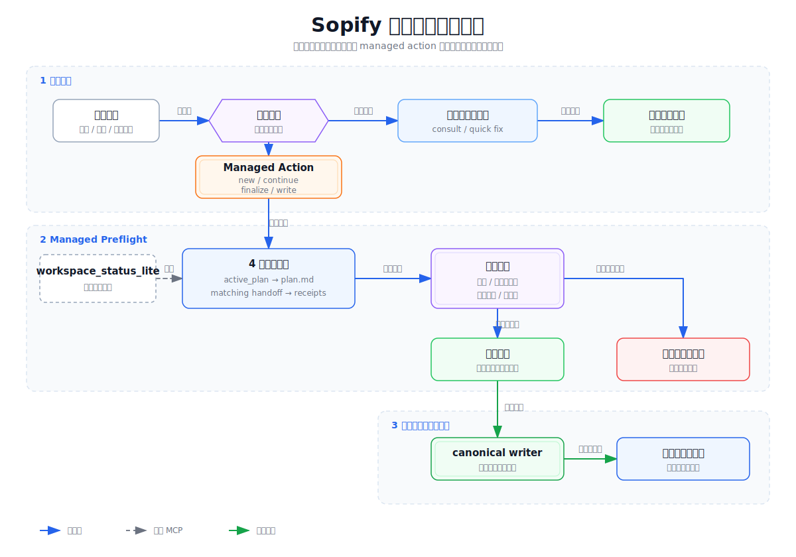

# 技术设计: Sopify 会话入口状态预检

## 技术方案

- 核心技术: P8 Host Protocol Entry Contract、两文件状态读取、可选的 `workspace_status_lite`、中英文宿主 prompt、pytest 与 Codex 上下文隔离回放。
- 实现要点:
  - 先判定用户意图，再决定是否读取状态链；状态预检不能成为全局前置 gate。
  - 4 步文件协议是所有宿主的规范路径；现有 MCP tool 可用时只合并读取客观事实，不新增推理型 tool 或 workflow verdict。
  - 状态异常按“正常、可继续异常、阻断冲突”三类处理，只有第三类等待用户决策。
  - 同一轮同一冲突最多检查一次、询问一次；用户批准写入后通过 canonical writer 执行并验证一次。

## 架构设计

架构只分三层：

1. **请求准入**：先判断本轮用户意图。consult / quick fix 直接完成并回复，不进入方案状态链。
2. **Managed preflight**：new plan、continue、finalize 和协议写入才读取 4 步文件协议；`workspace_status_lite` 只是可选的事实聚合入口。
3. **授权写入**：可继续的动作只有在获得当前请求授权后才进入 canonical writer；写入前确认状态未被其他 session 推进，写入后只复核一次；需要用户补事实或拍板时只询问一次并停车。

SVG 是总链路导读，不承载完整异常枚举。精确行为以下方状态矩阵和 `.sopify/blueprint/protocol.md` 为准，避免形成第二真相源。

## 状态处理矩阵

处理优先序固定为：**本轮用户意图 → active plan 有效性与主体绑定 → 仅消费与 active plan 匹配的 handoff/checkpoint**。consult / unmanaged quick fix 在第一步结束，不进入后两步；new plan 不响应旧方案 checkpoint，只完成自身的一次切换仲裁。

| 用户意图与状态 | 宿主行为 | 用户交互 |
|---|---|---|
| consult / unmanaged quick fix，任意方案状态 | 先完成当前请求，不读取或展示无关接续异常 | 无 |
| new plan，无 active plan | 创建方案并通过 writer 设置新指针 | 无 |
| new plan，active plan 无效或缺 `plan.md` | 创建新方案并由 writer 切到新指针；结果中说明替换了无效指针 | 不追加清理确认 |
| new plan，active plan 有效 | 停车确认切换、合并或暂停 | 一次决策 |
| continue / finalize / 协议写入，active plan 与 `plan.md` 有效 | 按 4 步链继续；缺 handoff / receipts 属正常降级 | 无 |
| continue，用户明确指定有效方案但本地无 active plan | 通过 writer 激活所指方案后继续 | 无 |
| continue，active plan 无效，但用户明确指定的方案有效 | 通过 writer 激活所指方案后继续；旧指针由本次授权动作自然替换 | 不追加清理确认 |
| continue / finalize，active plan 无效且用户未指定目标 | 说明阻断原因和可选目标后停车 | 一次决策 |
| handoff 与 active plan 失配 | 以 `plan.md` 为准，提示一次并继续；后续正常 handoff 写入自然替换 | 不等待 |
| 首次进入 continue，且匹配 active plan 的 handoff 有 `answer_questions` / `confirm_decision` checkpoint | 展示该 checkpoint 后停车；失配 handoff 不得触发 checkpoint | 一次响应 |
| 本轮用户正在回答匹配 active plan 的 checkpoint | 先消费回答并绑定当前 plan/checkpoint，通过 writer 更新一次并复核一次；不得先重显原 checkpoint | 不重问；回答无法唯一绑定时才提示一次 |
| 显式审计非 active plan | 审计器只读目标并返回证据；宿主校验目标主体后通过 writer 写目标方案未占用的 `verify_NNN` receipt；同名 receipt 已存在时拒绝覆盖，不切换 active plan / handoff | 无 |
| 同一 active plan 出现并行推进信号 | 当前 session 不执行有副作用的开发；可继续只读审计，或等待用户确认其他开发已停止后重读最新状态 | 一次决策 |

## Lite Status 最小事实

在保留现有字段的基础上，仅考虑增加：

- `active_plan_file_exists`: `active_plan.json` 文件是否存在，用于区分正常缺失与内容无效。
- `active_plan_md_exists`: 活动方案的 `plan.md` 是否存在；无活动方案时为 `null`。
- `handoff_plan_id`: handoff 指向的方案；无 handoff 时为 `null`。
- `handoff_matches_active_plan`: 两者是否一致；任一不存在时为 `null`。

字段只描述文件事实，不输出 `ready / blocked / repair` 等工作流结论。无效 active plan 定义为：文件存在，但内容不是含合法非空 `plan_id` 的对象，或对应 `plan.md` 缺失。非法 JSON 或读取失败继续走现有结构化 error；是否阻断由用户意图和协议矩阵决定。

`plan_id` 用于拼接 plan 路径前必须复用安全子路径校验或等价的 schema 约束；污染值返回结构化 error，不得探测 `plan/` 目录之外。MCP 不可用时，宿主直接按相同文件事实和协议矩阵处理，不得阻断入口。

## 防循环约束

1. 状态预检只在 managed plan / continuation / finalize / 协议写入入口运行一次。
2. 同一轮不得因同一个状态冲突重复调用检查或重复询问。
3. 用户批准状态写入后，只执行一次 canonical writer 写入和一次结果复核。
4. consult / quick fix 不因陈旧状态转入修复对话。
5. 不新增持久化“已提示”标记；跨会话再次执行同一受阻 managed action 时，仍以当前事实判断。

## 审计旁路写责

- 显式审计非 active plan 时，以 `subject_type=plan`、目标方案目录 `subject_ref` 和目标 `plan.md` 的 SHA-256 `revision_digest` 绑定主体；不切换 active plan。
- 审计器遵守 Verifier Read-Only Contract，只返回 `verdict / evidence / source`，不得写 `state/**`、`plan/**` 或 `blueprint/**`。
- 宿主重新校验 subject binding 后，仅通过 `sopify_writer` 将结果写入目标方案未占用的 `verify_NNN` receipt；`ProtocolStore` 复用 MCP 入口已有的防覆盖语义，同名文件存在时抛出 `FileExistsError` 并保留原证据。
- 本方案只补 writer 防覆盖不变量，不新增 receipt 编号器、锁或重试协议，也不升格完整 Review Wire、定义新的 evidence attachment schema 或接入 EvidentLoop。

## 多会话最小边界

- `active_plan` 仍是 workspace 级纯 `plan_id` 指针，不增加 Wave；Wave 和任务进度以 `plan.md` / `tasks.md` 为准，handoff 只作恢复提示。
- 宿主能提供 session 标识时，将其写入现有 `current_handoff.observability.provenance`；它只用于定位写入来源。不同 session 标识可能是正常接续，不能单独证明并发。
- 并行推进信号仅包括：用户明确要求同时开发；宿主确认另一任务仍在运行；从本轮最近一次已验证快照到首次有副作用开发前，目标 `plan.md` digest 或匹配 handoff 出现非本轮已知写入造成的变化。
- 出现并行推进信号时，当前 session 不执行有副作用的开发，只提示一次：`方案状态出现并行推进信号，本会话暂不写入。你可以继续只读审计，或确认其他开发已停止后在这里继续。`
- 用户确认接续后，宿主必须重读最新 `plan.md`、任务进度和匹配 handoff，再开始开发；无上述信号时不得误拦正常跨 session 接续。
- 不新增 session state、所有权、注册表、锁文件、心跳或租约；若未来必须并行开发同一方案，另行评估 worktree 和任务拆分，不纳入本方案。

## 验证设计

### 自动化状态与 writer 守卫

- `.sopify/` 不存在或无 active plan。
- active plan 有效且缺 handoff / receipts。
- active plan 目录存在但缺 `plan.md`。
- handoff 与 active plan 一致或失配。
- active plan 内容为 JSON `null`、数组、缺 `plan_id` 对象或污染路径时返回现有结构化 error，不产生写入。
- `ProtocolStore` 首次写入 `verify_NNN` 成功；再次写入同一 receipt 时抛出 `FileExistsError`，原文件内容不变。

### 宿主资产静态校验

- 静态测试断言完整规范句，不以单个关键词出现代替语义检查。
- 中英文源 prompt 及安装后的 Codex 中文、Claude 英文资产精确保留以下语义：
  - 用户正在回答匹配 checkpoint 时先消费回答，不重显同一 checkpoint。
  - 无效旧指针遇到明确 new plan 或明确且有效的 continue 目标时，不追加清理确认。
  - 旧 active plan 仍有效且目标发生切换时，必须等待用户确认。
  - 4 步文件协议是规范路径，MCP 不可用时仍可进入 managed action。
  - machine truth 只通过 `sopify_writer` 写入。
  - `active_plan` 只含 `plan_id`，Wave 和任务进度从方案文件读取。
  - 显式审计非 active plan 时，审计器只读并返回证据；宿主校验目标 `plan.md` digest 后通过 writer 写 `verify_NNN` receipt，active pointer / handoff 不变。
  - 不同 session 标识单独出现不得阻断；只有约定的三类并行推进信号才停止当前有副作用的开发，并只展示一次约定提示。
- 不引入新的 state、tool、自动修复或强并发承诺表述。

### Codex 上下文隔离回放

Codex 是本次选取的代表宿主；Claude、Qoder 等仍属于 Sopify 的宿主范围。“上下文隔离”指回放启动不继承当前方案讨论的新 Codex 会话，临时 workspace 只负责隔离文件状态。通过标准是：Codex 完整回答 fixture 问题，不要求先修复状态、不自动写入状态。该回放只执行一次；证据摘要记录新会话标识、fixture 问题、执行命令与宿主版本、回答断言，以及回放前后 `state/` 文件清单与哈希。结果只证明该路径在 Codex 中成立，不代表其他宿主已经实测。

## 文档收口

- `protocol.md` 作为 normative 处理规则真相源。
- `docs/how-sopify-works*.md` 与 `docs/getting-started.md` 消除“缺 active plan 自动浏览并接续”的歧义：可以发现候选，但不得脱离用户意图自动恢复。
- `blueprint/design.md` 只沉淀稳定边界；`blueprint/tasks.md` 在完成后移除对应长期待办；`blueprint/README.md` 仅刷新当前焦点。

## 安全与性能

- 安全: 不自动清理或迁移 machine truth；有效活动方案的切换始终由用户确认；已有 receipt 不被覆盖。
- 性能: lite status 只读取固定路径和两个短 JSON 文件，不扫描全量 receipts、history 或工具清单。
