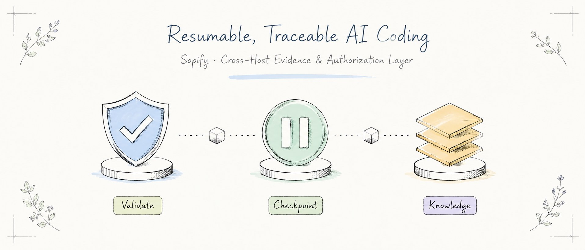
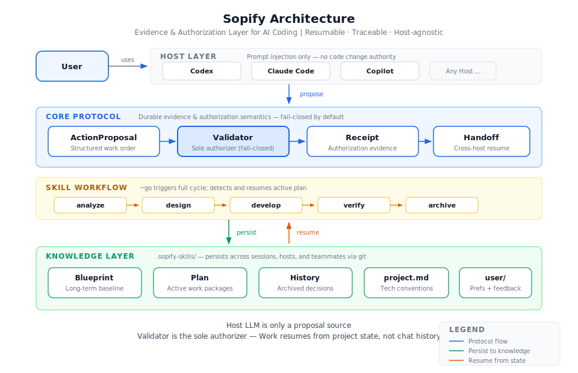

# Sopify

<div align="center">

**AI coding that asks before it acts**

[](./LICENSE)
[](./LICENSE-docs)
[](#version-history)
[](./CONTRIBUTING.md)

English · [简体中文](./README.zh-CN.md) · [Quick Start](#quick-start) · [Contributors](./CONTRIBUTORS.md)

</div>

<div align="center">

</div>

---

AI coding tools are fast. But when they jump to code without understanding what's needed, speed becomes rework. Sopify is a protocol layer that stops when facts are missing, waits when a decision needs your sign-off, and resumes from the last checkpoint — even across different AI hosts.

No new editor, no new CLI. Install into the host you already use — Codex, Claude, or Copilot.

**Design principles:**

- **Stop when unsure** — score every requirement; ask before assuming
- **Resume from anywhere** — checkpoint-based; switch hosts, machines, or teammates without re-explaining
- **Trace every decision** — plans, choices, and reviews persist in `.sopify/`

**What Sopify prevents:**

- **Premature coding** — AI starts changing code before missing facts or decisions are resolved
- **Lost context** — switching hosts, machines, or teammates forces the work to be re-explained
- **Forgotten decisions** — important tradeoffs disappear into chat history instead of becoming project artifacts

[See the workflow diagram, checkpoints, and resume flow →](./docs/how-sopify-works.en.md)

## See It In Action

<p align="center">
  
</p>

## Quick Start

```bash
curl -fsSL https://github.com/evidentloop/sopify/releases/latest/download/install.sh | bash -s -- --target codex:en-US
```

After install, use `~go` to start a managed workflow. See [Installation](#installation) for other hosts, audit-first install, and Windows.

**Already in a Sopify-managed repo?** Open any AI host and continue — it picks up from where you left off.

## Why Sopify?

**When requirements are unclear, it stops to plan first.**
You say "add a caching layer." Sopify doesn't start coding — it plans first: analyze, design, split into tasks, then save to `.sopify/plan/`. Only after you confirm the plan does it write code. Every line changed traces back to a decision.

**Your teammate picks up where you left off.**
You start a feature in Codex, finish the design, and implement two of four tasks. Next week your teammate opens the same repo in Claude, types `~go`. Sopify reads the checkpoint and continues from task 3 — no handoff doc, no re-explaining context.

**Every decision leaves a trace.**
A month later, someone asks why the cache key includes the user ID. The answer is in `.sopify/plan/` — the requirement that prompted the decision, the design that resolved it, the review that approved it.

## Architecture

<div align="center">

</div>

The LLM is only a proposal source. The Validator is the sole authorizer — every action is proposed, validated, and receipted before it touches your code. Knowledge persists in `.sopify/`, accessible across sessions, hosts, and teammates.

How Sopify achieves stability and quality:

- Workflow rules live outside model memory — hosts load the same Sopify rules, so switching between Claude, Codex, or Copilot does not reset the workflow
- State persists to the repo — plans, decisions, and checkpoints live in `.sopify/`, so the next session resumes from project state, not chat history
- Runtime checks gate execution — before code is written, Sopify verifies plan completeness, unresolved risks, and pending decisions; if something is missing, it stops and asks

This isn't prompt-level advice — it's a deterministic gate. If the plan isn't complete, execution doesn't proceed.

## Installation

Audit-first install:

```bash
curl -fsSL -o sopify-install.sh https://github.com/evidentloop/sopify/releases/latest/download/install.sh
less sopify-install.sh          # review before running
bash sopify-install.sh --target codex:en-US
```

Windows PowerShell:

```powershell
iwr https://github.com/evidentloop/sopify/releases/latest/download/install.ps1 -OutFile sopify-install.ps1
Get-Content sopify-install.ps1 | more
.\sopify-install.ps1 --target codex:en-US
```

Install targets:

| Host | Target | Status |
|------|--------|--------|
| Codex | `codex:en-US` / `codex:zh-CN` | Deep verified — suitable for daily use |
| Claude | `claude:en-US` / `claude:zh-CN` | Deep verified — suitable for daily use |
| Copilot | `copilot:en-US` / `copilot:zh-CN` | Baseline — feedback welcome |

Pass `--workspace <path>` to target another repo, `--language <lang>` to control output language.

For the full setup guide, see [Getting Started](./docs/getting-started.md). For a step-by-step demo, see [External Repo Quickstart](./examples/external-repo-quickstart/README.md).

## Command Reference

| Command | Description |
|---------|-------------|
| `~go` | Automatically route and run the full workflow (auto-resumes if active plan exists) |
| `~go plan` | Plan only |
| `~go finalize` | Close out the active plan |

Most users only need `~go` and `~go plan`; maintainer validation commands live in [CONTRIBUTING.md](./CONTRIBUTING.md).

## Configuration

```bash
cp examples/sopify.config.yaml ./sopify.config.yaml
```

```yaml
brand: auto
language: en-US

workflow:
  mode: adaptive   # strict | adaptive | minimal
  require_score: 7

```

## Directory Structure

```text
sopify/
├── scripts/               # install, diagnostics, and maintainer scripts
├── examples/              # configuration examples
├── docs/                  # workflow guides and developer references
├── runtime/               # built-in runtime / skill packages
├── skills/                # prompt-layer source of truth
├── .sopify/        # project knowledge base
│   ├── blueprint/         # design baseline, reduction targets
│   ├── plan/              # active plans
│   └── history/           # archived plans
└── installer/             # host adapters and install orchestration
```

See [How Sopify Works](./docs/how-sopify-works.en.md) for the full workflow, checkpoints, and knowledge layout.

## Version History

- See [CHANGELOG.md](./CHANGELOG.md) for the detailed history

## License

- Code and config: Apache 2.0, see [LICENSE](./LICENSE)
- Documentation: CC BY 4.0, see [LICENSE-docs](./LICENSE-docs)

## Contributing

For user-visible behavior changes, update both `README.md` and `README.zh-CN.md` when needed, then follow [CONTRIBUTING.md](./CONTRIBUTING.md) for validation.
