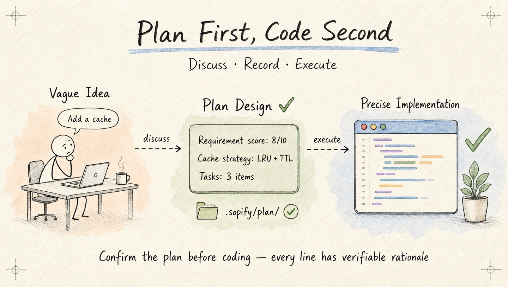
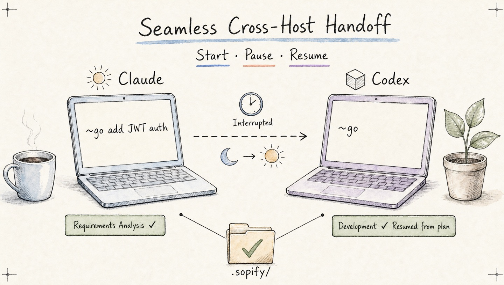
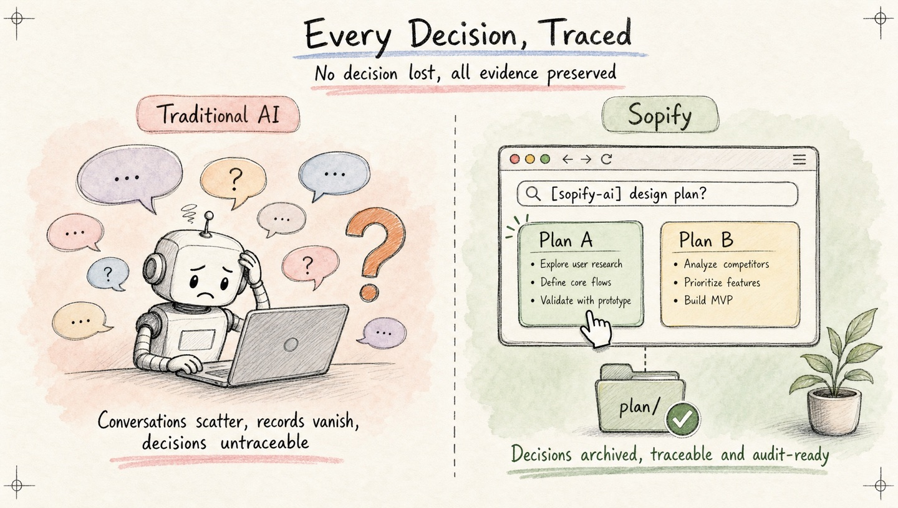
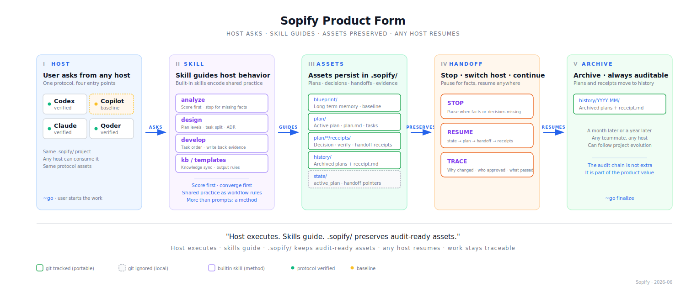

# Sopify

<div align="center">

**Resumable AI coding — ask first, plans stay with the repo**

[](./LICENSE)
[](./LICENSE-docs)
[](#version-history)
[](./CONTRIBUTING.md)

[](#quick-start)
[](#quick-start)
[](#quick-start)
[](#quick-start)

English · [简体中文](./README.zh-CN.md) · [Quick Start](#quick-start) · [Contributors](./CONTRIBUTORS.md)

</div>

<div align="center">

</div>

---

AI coding tools are fast. But when they jump to code before the facts are clear, speed turns into rework. Sopify is a development process protocol layer for AI coding: in managed workflows, the host asks before coding when requirements are incomplete or a decision still needs you.

Sopify stores plans and verification receipts in `.sopify/` as project files tracked by git. Only the local resume pointers stay out of git. Open the same repo on another host, and it reads those files to continue from where the work stopped.

No new editor, no new CLI. Install into the host you already use — Codex, Claude, Qoder, or Copilot.

**Design principles:**

- **Stop when unsure** — score every requirement; ask before assuming
- **Resume from anywhere** — plans and verification receipts are tracked in `.sopify/`; open the repo on any host and pick up where you left off
- **Trace every decision** — plans, choices, and reviews persist in `.sopify/`

**What Sopify prevents:**

- **Premature coding** — AI starts changing code before missing facts or decisions are resolved
- **Lost context** — switching hosts, machines, or teammates forces the work to be re-explained
- **Forgotten decisions** — important tradeoffs disappear into chat history instead of becoming project artifacts

[See the workflow diagram, checkpoints, and resume flow →](./docs/how-sopify-works.en.md)

## See It In Action

<p align="center">
  
</p>

## Quick Start

```bash
curl -fsSL https://github.com/evidentloop/sopify/releases/latest/download/install.sh | bash -s -- --target codex:en-US
```

After install, use `~go` to start a managed workflow. See [Installation](#installation) for other hosts, audit-first install, and Windows.

**Already in a Sopify-managed repo?** Open any AI host and continue — it picks up from where you left off.

## Why Sopify?

**When requirements are unclear, it stops to plan first.**
You say "add a caching layer." Sopify doesn't start coding — it plans first: analyze, design, split into tasks, then save to `.sopify/plan/`. Only after you confirm the plan does it write code. Every line changed traces back to a decision.

<div align="center">

</div>

**Your teammate picks up where you left off.**
You start a feature in Codex, finish the design, and implement two of four tasks. Next week your teammate opens the same repo in Claude, types `~go`. Sopify reads the checkpoint and continues from task 3 — no handoff doc, no re-explaining context.

<div align="center">

</div>

**Every decision leaves a trace.**
A month later, someone asks why the cache key includes the user ID. The answer is in `.sopify/plan/` — the requirement that prompted the decision, the design that resolved it, the review that approved it.

<div align="center">

</div>

## Product Form

<div align="center">

</div>

The host LLM executes. Sopify preserves auditable development assets — plans, decisions, handoffs, and verification evidence — in `.sopify/`, accessible across sessions, hosts, and teammates.

How Sopify achieves stability and quality:

- **Same rules on every host** — Claude, Codex, Qoder, and Copilot load the same Sopify instructions, so switching hosts doesn't reset the workflow
- **Project assets tracked in git** — plans, decisions, and verification records live in `.sopify/`; only the two local pointer files (`active_plan.json`, `current_handoff.json`) are gitignored
- **Resumes from where you stopped** — the host reads the current plan, picks up the last handoff, and checks what's already been verified before continuing
- **Runtime retired; workflow retained** — the analyze → design → develop → finalize workflow is unchanged; what changed is that rules live in files, not a runtime process

## Architecture Details

For readers who want the internal layering behind the product form, the technical structure is below.

<div align="center">

</div>

## Installation

Audit-first install:

```bash
curl -fsSL -o sopify-install.sh https://github.com/evidentloop/sopify/releases/latest/download/install.sh
less sopify-install.sh          # review before running
bash sopify-install.sh --target codex:en-US
```

Windows PowerShell:

```powershell
iwr https://github.com/evidentloop/sopify/releases/latest/download/install.ps1 -OutFile sopify-install.ps1
Get-Content sopify-install.ps1 | more
.\sopify-install.ps1 --target codex:en-US
```

Host support:

| Host | Tier | Target | Notes |
|------|------|--------|-------|
| Codex | PROTOCOL_VERIFIED | `codex:en-US` / `codex:zh-CN` | Full capability continuation |
| Claude | PROTOCOL_VERIFIED | `claude:en-US` / `claude:zh-CN` | Full capability continuation |
| Qoder | PROTOCOL_VERIFIED | `qoder` | Validated on Qoder CLI |
| Copilot | BASELINE_SUPPORTED | `copilot:en-US` / `copilot:zh-CN` | Prompt-only; payload uplift planned |

Pass `--workspace <path>` to target another repo, `--language <lang>` to control output language.

For the full setup guide, see [Getting Started](./docs/getting-started.md). For a step-by-step demo, see [External Repo Quickstart](./examples/external-repo-quickstart/README.md).

## Command Reference

| Command | Description |
|---------|-------------|
| `~go` | Automatically route and run the full workflow (auto-resumes if active plan exists) |
| `~go plan` | Plan only |
| `~go finalize` | Close out the active plan |

Most users only need `~go` and `~go plan`; maintainer validation commands live in [CONTRIBUTING.md](./CONTRIBUTING.md).

## Configuration

```bash
cp examples/sopify.config.yaml ./sopify.config.yaml
```

```yaml
brand: auto
language: en-US

workflow:
  mode: adaptive   # strict | adaptive | minimal
  require_score: 7

```

## Directory Structure

```text
sopify/
├── scripts/               # install, diagnostics, and maintainer scripts
├── examples/              # configuration examples
├── docs/                  # workflow guides and developer references
├── sopify_writer/         # protocol asset writer library
├── sopify_contracts/      # schema definitions and shared data structures
├── skills/                # prompt-layer source of truth
├── installer/             # host adapters and install orchestration
└── .sopify/               # project protocol root
    ├── blueprint/         # protocol spec, design baseline, reduction targets
    ├── plan/              # active plans + receipts
    └── history/           # archived plans + receipts
```

See [How Sopify Works](./docs/how-sopify-works.en.md) for the full workflow, checkpoints, and knowledge layout.

## Version History

- See [CHANGELOG.md](./CHANGELOG.md) for the detailed history

## License

- Code and config: Apache 2.0, see [LICENSE](./LICENSE)
- Documentation: CC BY 4.0, see [LICENSE-docs](./LICENSE-docs)

## Contributing

For user-visible behavior changes, update both `README.md` and `README.zh-CN.md` when needed, then follow [CONTRIBUTING.md](./CONTRIBUTING.md) for validation.
