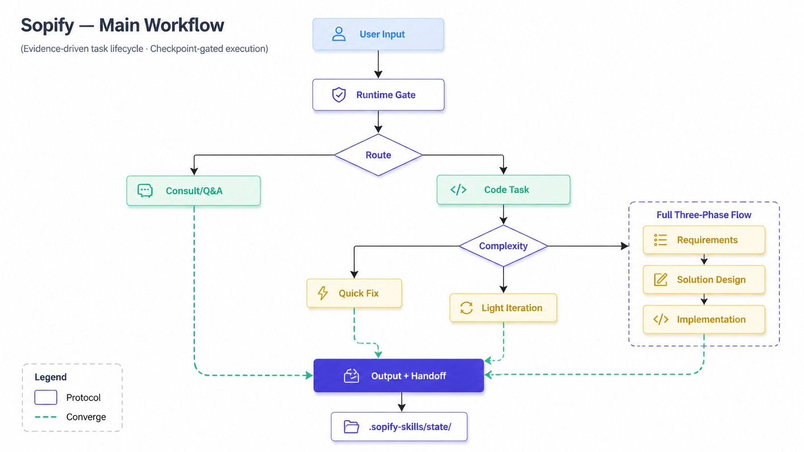

# Sopify

<div align="center">


**Resumable, traceable AI coding — decisions and history stay with the project**

[](./LICENSE)
[](./LICENSE-docs)
[](#version-history)
[](./CONTRIBUTING.md)

English · [简体中文](./README.zh-CN.md) · [Quick Start](#quick-start) · [Contributors](./CONTRIBUTORS.md)

</div>

<div align="center">

</div>

---

When facts are missing, Sopify stops and asks. When a decision needs your approval, it waits. When work is interrupted, it resumes from the last stopping point — even across different AI hosts.

## Quick Start

```bash
curl -fsSL https://github.com/evidentloop/sopify/releases/latest/download/install.sh | bash -s -- --target codex:en-US
```

After install, use `~go` to start a managed workflow. See [Installation](#installation) for other targets, platforms, and verification.

**Already in a Sopify-managed repo?** Open any AI host and continue the unfinished task — it picks up from where you left off. [Full walkthrough →](./docs/how-sopify-works.en.md)

| Step | What happens |
|------|-------------|
| Start | Ask the host to begin or continue a task |
| Pause | Sopify stops when facts are missing or a decision needs you |
| Resume | Work picks up from project state — even on a different host |

---

## Why Sopify?

As repositories grow, AI-assisted development runs into a hidden problem: decision context stays trapped in chat history, each new session re-derives the project state, and the user's mental model, the AI's understanding, and the codebase start to drift apart.

Sopify uses project-level conventions to make critical steps visible. The basic process record is generated automatically, but the long-term compounding value still depends on consistently closing out work and maintaining project knowledge.

| Gap | Sopify's answer |
|-----|-----------------|
| State is trapped in a single host's chat session | Portable project state — switch hosts mid-task |
| No independent quality gate | An isolated, independent review pass before execution |
| Decisions are invisible and non-auditable | Plan changes force re-confirmation — the AI cannot silently proceed |
| Each session's learning is disposable | Plans, decisions, and reviews persist as reusable project assets |

## Architecture

<div align="center">

</div>

User input flows through a host adapter (Codex, Claude, Copilot) into the Core Protocol, where every action is proposed, validated, gated, and receipted. The Validator is the sole authorizer — the host LLM is only a proposal source. Knowledge layers (blueprint, plan, history) persist across sessions and hosts.

## Installation

Two-step install (recommended for first-time review):

```bash
curl -fsSL -o sopify-install.sh https://github.com/evidentloop/sopify/releases/latest/download/install.sh
sed -n '1,40p' sopify-install.sh
bash sopify-install.sh --target codex:en-US
```

Windows PowerShell:

```powershell
iwr https://github.com/evidentloop/sopify/releases/latest/download/install.ps1 -OutFile sopify-install.ps1
Get-Content sopify-install.ps1 -TotalCount 40
.\sopify-install.ps1 --target codex:en-US
```

The repo-local install path remains available for developers and maintainers:

```bash
bash scripts/install-sopify.sh --target codex:en-US
python3 scripts/install_sopify.py --target claude:en-US --workspace /path/to/project
```

Install targets:

- `codex:zh-CN`
- `codex:en-US`
- `claude:zh-CN`
- `claude:en-US`

The protocol works with any host. Verified runtime integrations today:

| Host | Install target | Availability | Validation coverage | Notes |
|------|----------------|--------------|---------------------|-------|
| `codex` | `codex:zh-CN` / `codex:en-US` | Deep verified | Host install flow, workspace bootstrap, and runtime package smoke are verified | Suitable for daily use |
| `claude` | `claude:zh-CN` / `claude:en-US` | Deep verified | Host install flow, workspace bootstrap, and runtime package smoke are verified | Suitable for daily use |
| `copilot` | Bootstrap only | Workspace ready | Bootstrap, instruction distribution, and workspace marker are verified | Trigger wiring coming next |

Notes:

- Use `sopify status` / `sopify doctor` for detailed capability claims and live diagnostics
- `Availability` expresses the current delivery tier, while `Validation coverage` describes what has already been validated

### Setup Paths

| You want to… | Script | Command |
|--------------|--------|---------|
| Set up a new host (Codex / Claude) | `install.sh` | As shown above — installs host prompt layer + Sopify payload |
| Add Sopify to an existing repo | `bootstrap.sh` | `curl -fsSL .../bootstrap.sh \| bash` — workspace only, no global install |

- `install.sh` installs the selected host prompt layer and the Sopify payload. Most users do not need `--workspace`; that is an advanced prewarm path for maintainers or CI.
- `bootstrap.sh` creates `.sopify-skills/sopify.json`, updates `.gitignore`, and distributes Copilot instruction files. Pass `--no-copilot` to skip Copilot files.

For the full setup guide, see [Getting Started](./docs/getting-started.md). For a step-by-step demo, see [External Repo Quickstart](./examples/external-repo-quickstart/README.md).

### After Install

- Use `~go` when you want Sopify to manage the full task workflow for you.
- Interrupt anytime — come back (even in a different tool) and resume from where you left off.
- Complex changes can get an independent review before execution starts.
- Run `status` to see current progress, `doctor` to troubleshoot.

### Verify Your Install

```bash
python3 scripts/sopify_status.py --format text
python3 scripts/sopify_doctor.py --format text
```

- `will bootstrap on first project trigger`: the host install is ready and the project-local runtime has not been prepared yet
- `workspace outcome: stub_selected [continue]`: the workspace runtime entry is healthy
- Payload or bundle corruption errors (for example `global_bundle_missing`, `global_bundle_incompatible`, or `global_index_corrupted`): repair the install and retry

### First Use

After install, open your selected host inside a repository and paste one of the prompts below.

```text
# Simple task
"Fix the typo on line 42 in src/utils.ts"

# Medium task
"Add error handling to login, signup, and password reset"

# Complex task
"~go Add user authentication with JWT"

# Plan only
"~go plan Refactor the database layer"
```

### What It Looks Like

<div align="center">

</div>

The workflow follows a start → pause → resume cycle. Sopify stops automatically when facts are missing or a decision needs confirmation, and picks up from the last checkpoint — even if you switch to a different AI host.

For the full workflow, checkpoints, and plan lifecycle details, see [How Sopify Works](./docs/how-sopify-works.en.md).

## Configuration

Start from the example config:

```bash
cp examples/sopify.config.yaml ./sopify.config.yaml
```

Most commonly used settings:

```yaml
brand: auto
language: en-US

workflow:
  mode: adaptive
  require_score: 7

plan:
  directory: .sopify-skills
```

Notes:

- `workflow.mode` supports `strict / adaptive / minimal`
- `plan.directory` only affects newly created knowledge and plan directories

## Command Reference

| Command | Description |
|---------|-------------|
| `~go` | Automatically route and run the full workflow |
| `~go plan` | Plan only |
| `~go exec` | Advanced restore/debug entry, not the default user path |
| `~go finalize` | Close out the current metadata-managed plan |

Most users only need `~go` and `~go plan`; maintainer validation commands live in [CONTRIBUTING.md](./CONTRIBUTING.md).

## Directory Structure

```text
sopify/
├── scripts/               # install, diagnostics, and maintainer scripts
├── examples/              # configuration examples
├── docs/                  # workflow guides and developer references
├── runtime/               # built-in runtime / skill packages
├── .sopify-skills/        # project knowledge base
│   ├── blueprint/         # design baseline, reduction targets
│   │   └── architecture-decision-records/  # ADR entity files
│   ├── plan/              # active plans
│   └── history/           # archived plans
├── Codex/                 # Codex host prompt layer
└── Claude/                # Claude host prompt layer
```

This is a simplified view of the core layout. See [docs/how-sopify-works.en.md](./docs/how-sopify-works.en.md) for the full workflow, checkpoints, and knowledge layout.

## FAQ

### Q: How do I switch language?

Update `sopify.config.yaml`:

```yaml
language: zh-CN  # or en-US
```

### Q: Where are plan packages stored?

By default they live under `.sopify-skills/` in the project root. To change that:

```yaml
plan:
  directory: .my-custom-dir
```

This only affects newly created directories; existing history is not migrated automatically.

### Q: When should I use `--workspace` prewarm?

Most users do not need it. A default install is already complete; Sopify bootstraps the project-local runtime automatically on the first trigger.

Use `--workspace` only for maintainer validation, CI, or when you explicitly want to prewarm a specific repository ahead of time. For this advanced path, use the repo-local installer:

```bash
python3 scripts/install_sopify.py --target codex:en-US --workspace /path/to/project
```

### Q: How do I reset learned preferences?

Delete or clear `.sopify-skills/user/preferences.md`; keep `feedback.jsonl` only if you still want the audit trail.

### Q: When should I run sync scripts?

When you change `Codex/Skills/{CN,EN}`, the mirrored `Claude/Skills/{CN,EN}` content, or `runtime/builtin_skill_packages/*/skill.yaml`, follow the validation steps in [CONTRIBUTING.md](./CONTRIBUTING.md).

## Version History

- See [CHANGELOG.md](./CHANGELOG.md) for the detailed history

## License

This repository uses dual licensing:

- Code and config: Apache 2.0, see [LICENSE](./LICENSE)
- Documentation: CC BY 4.0, see [LICENSE-docs](./LICENSE-docs)

## Contributing

For user-visible behavior changes, update both `README.md` and `README.zh-CN.md` when needed, then follow [CONTRIBUTING.md](./CONTRIBUTING.md) for validation.
