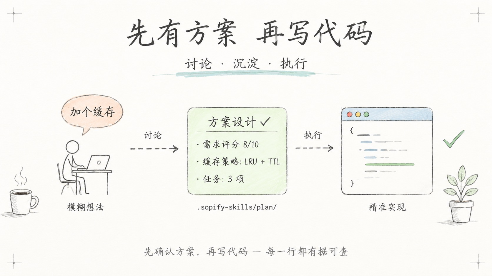
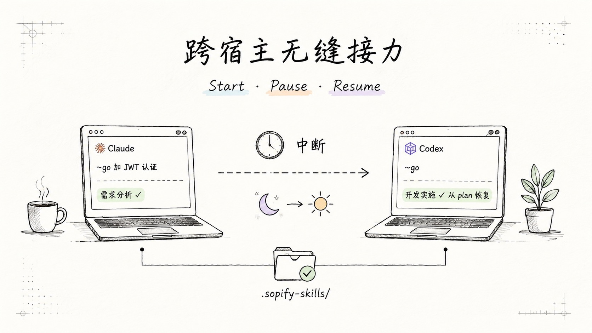
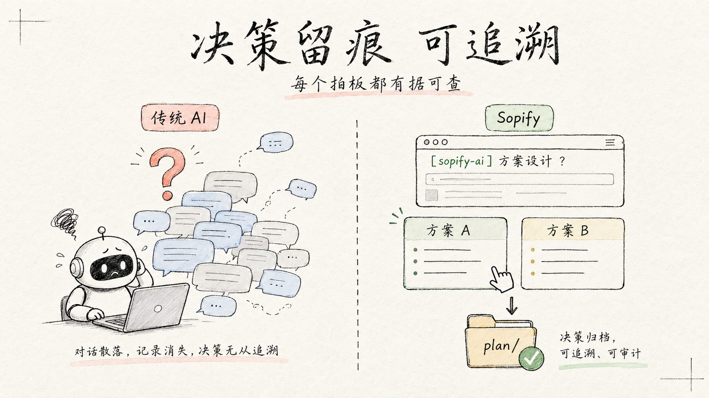

# Sopify

<div align="center">

**先问再写、随时恢复的 AI 编程**

[](./LICENSE)
[](./LICENSE-docs)
[](#版本历史)
[](./CONTRIBUTING_CN.md)

[English](./README.md) · 简体中文 · [快速开始](#快速开始) · [贡献者](./CONTRIBUTORS.md)

</div>

<div align="center">

</div>

---

Sopify 是一个 AI 辅助开发的协议层。缺事实时停下来问，需要拍板时等你确认，中断后从上次 checkpoint 恢复——即使切换到不同的 AI 宿主也能接力。

无需新编辑器、无需新 CLI。安装到你已有的宿主：Codex、Claude、Copilot 均支持。

**设计原则：**

- **不确定就停下** — 需求不全时先追问，再动手
- **随时恢复** — 基于 checkpoint；换宿主、换机器、换人接手都不用重新交代
- **决策留痕** — 方案、取舍、审查持久保存在 `.sopify-skills/`

## 实战演示

<p align="center">
  
</p>

## 快速开始

```bash
curl -fsSL https://github.com/evidentloop/sopify/releases/latest/download/install.sh | bash -s -- --target codex:zh-CN
```

安装后用 `~go` 启动全托管工作流。审查优先安装、其他宿主和 Windows 请看[安装说明](#安装说明)。

**已在 Sopify 管理的仓库里？** 打开任意 AI 宿主，让它继续未完成的任务——它会从上次停点恢复。[完整演练 →](./docs/how-sopify-works.md)

## 为什么选择 Sopify？

**需求不清楚时，它会停下来。**
你说"加个缓存"。Sopify 不急着动手——先分析需求、设计方案、拆分任务，把讨论结果沉淀到 `.sopify-skills/plan/` 里。方案确认后才写代码，改的每一行都有据可查。

<div align="center">

</div>

**你的队友可以直接接手。**
你在 Codex 里开始一个功能，完成了设计和两个任务。下周队友打开同一个仓库的 Claude，输入 `~go`。Sopify 读取 checkpoint，从任务 3 继续——不用写交接文档，不用重新交代上下文。

<div align="center">

</div>

**每个决策都留有痕迹。**
一个月后，有人问为什么缓存 key 里带了用户 ID。答案在 `.sopify-skills/plan/` 里——触发这个决策的需求、设计它的方案、通过它的审查，一应俱全。

<div align="center">

</div>

## 架构

<div align="center">

</div>

宿主 LLM 只是提议者，Validator 是唯一裁决者——每个操作都经历提议、校验、收据三步，才会触碰你的代码。知识（蓝图、方案、历史）持久保留在 `.sopify-skills/` 中，跨 session、宿主和团队成员均可访问。

## 安装说明

审查优先安装：

```bash
curl -fsSL -o sopify-install.sh https://github.com/evidentloop/sopify/releases/latest/download/install.sh
less sopify-install.sh          # 审查后再执行
bash sopify-install.sh --target codex:zh-CN
```

Windows PowerShell：

```powershell
iwr https://github.com/evidentloop/sopify/releases/latest/download/install.ps1 -OutFile sopify-install.ps1
Get-Content sopify-install.ps1 | more
.\sopify-install.ps1 --target codex:zh-CN
```

安装 target：

| 宿主 | Target | 状态 |
|------|--------|------|
| Codex | `codex:zh-CN` / `codex:en-US` | 深度验证 — 适合日常使用 |
| Claude | `claude:zh-CN` / `claude:en-US` | 深度验证 — 适合日常使用 |
| Copilot | `copilot:zh-CN` / `copilot:en-US` | 基础支持 — 欢迎反馈 |

可用 `--workspace <path>` 指定目标仓库，`--language <lang>` 控制输出语言。

完整设置指南见 [Getting Started](./docs/getting-started.md)。分步 demo 见 [External Repo Quickstart](./examples/external-repo-quickstart/README.md)。

## 命令参考

| 命令 | 说明 |
|-----|------|
| `~go` | 自动判断并执行完整流程（有活动 plan 时自动恢复执行） |
| `~go plan` | 只规划不执行 |
| `~go finalize` | 收口当前活动方案 |

普通用户只需要记住 `~go / ~go plan`；维护者验证命令放在 [贡献指南](./CONTRIBUTING_CN.md)。

## 配置说明

```bash
cp examples/sopify.config.yaml ./sopify.config.yaml
```

```yaml
brand: auto
language: zh-CN

workflow:
  mode: adaptive   # strict | adaptive | minimal
  require_score: 7

plan:
  directory: .sopify-skills
```

`plan.directory` 只影响后续新生成的知识库与方案目录。

## 目录结构

```text
sopify/
├── scripts/               # 安装、诊断与维护脚本
├── examples/              # 配置示例
├── docs/                  # 工作流指南与开发者参考
├── runtime/               # 内置 runtime / skill packages
├── skills/                # prompt-layer 源码
├── .sopify-skills/        # 项目知识库
│   ├── blueprint/         # 设计基线与削减目标
│   ├── plan/              # 活跃方案
│   └── history/           # 已归档方案
└── installer/             # 宿主适配器与安装编排
```

完整工作流、checkpoint 和知识库层级说明见 [工作流说明](./docs/how-sopify-works.md)。

## 版本历史

- 详细变更记录见 [CHANGELOG.md](./CHANGELOG.md)

## 许可证

- 代码与配置：Apache 2.0，见 [LICENSE](./LICENSE)
- 文档：CC BY 4.0，见 [LICENSE-docs](./LICENSE-docs)

## 贡献

提交用户可见行为改动时，建议同步更新 `README.md` / `README.zh-CN.md`，并参考 [CONTRIBUTING_CN.md](./CONTRIBUTING_CN.md) 执行校验。
