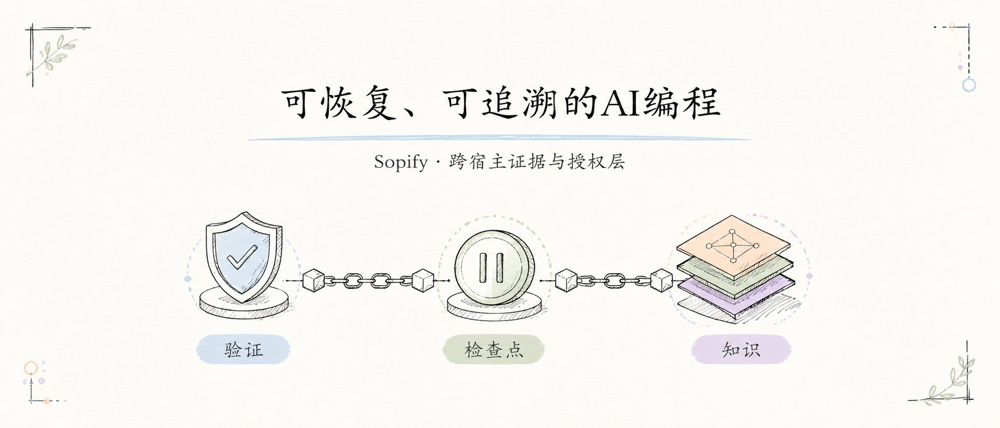
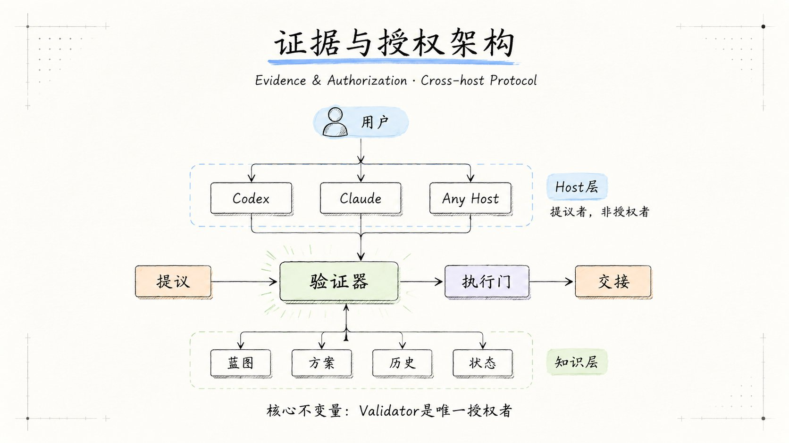
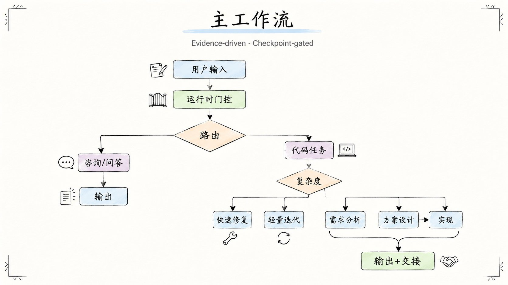

# Sopify

<div align="center">


**可恢复、可追溯的 AI 编程 — 决策和历史跟着项目走**

[](./LICENSE)
[](./LICENSE-docs)
[](#版本历史)
[](./CONTRIBUTING_CN.md)

[English](./README.md) · 简体中文 · [快速开始](#快速开始) · [贡献者](./CONTRIBUTORS.md)

</div>

<div align="center">

</div>

---

缺事实时停下来补事实，需要拍板时等待你确认，中断后从上次停点恢复——即使切换到不同的 AI 宿主也能接力。

## 快速开始

```bash
curl -fsSL https://github.com/evidentloop/sopify/releases/latest/download/install.sh | bash -s -- --target codex:zh-CN
```

安装后用 `~go` 启动全托管工作流。其他 target 和平台请看[安装说明](#安装说明)。

**已在 Sopify 管理的仓库里？** 打开任意 AI 宿主，让它继续未完成的任务——它会从上次停点恢复。[完整演练 →](./.sopify-skills/blueprint/protocol.md#4-典型生命周期样例)

| 步骤 | 发生了什么 |
|------|-----------|
| 开始 | 让宿主开始或继续一个任务 |
| 暂停 | 缺少事实或需要你拍板时，Sopify 自动停下 |
| 恢复 | 从项目状态接续——即使切换到另一个宿主 |

---

## 为什么选择 Sopify？

随着仓库增长，AI 辅助开发会遇到一个隐性问题：决策依据散落在对话里，每次新 session 都要重新理解上下文，用户认知、AI 理解和代码现状会逐渐偏离。

Sopify 用项目级约定把关键节点变成可见流程。基础过程记录会自动产生，长期复利则取决于是否持续做阶段收口和维护知识资产。

| 差距 | Sopify 的回答 |
|------|--------------|
| 状态锁定在单一宿主的聊天 session 中 | 可携带的项目状态 — 任务进行中随时切换宿主 |
| 缺少独立质量闸门 | 可在执行前增加隔离的独立审查 |
| 决策不可见、不可审计 | 方案变更后必须重新确认 — AI 不能静默继续 |
| 每个 session 的学习都是一次性的 | 方案、决策、审查结论沉淀为可复用的项目资产 |

## 架构

<div align="center">

</div>

用户输入经过宿主适配器（Codex、Claude 等）进入核心协议层，每个操作都经历提议、校验、闸门、收据四步。Validator 是唯一授权者 — 宿主 LLM 只是提议来源。知识层（蓝图、方案、历史）跨 session 和宿主持久保留。

## 安装说明

两步安装（推荐首次使用时先审查再执行）：

```bash
curl -fsSL -o sopify-install.sh https://github.com/evidentloop/sopify/releases/latest/download/install.sh
sed -n '1,40p' sopify-install.sh
bash sopify-install.sh --target codex:zh-CN
```

Windows PowerShell：

```powershell
iwr https://github.com/evidentloop/sopify/releases/latest/download/install.ps1 -OutFile sopify-install.ps1
Get-Content sopify-install.ps1 -TotalCount 40
.\sopify-install.ps1 --target codex:zh-CN
```

开发者 / 源码安装路径仍保留：

```bash
bash scripts/install-sopify.sh --target codex:zh-CN
python3 scripts/install_sopify.py --target claude:zh-CN --workspace /path/to/project
```

安装 target：

- `codex:zh-CN`
- `codex:en-US`
- `claude:zh-CN`
- `claude:en-US`

协议层适用于任何宿主。当前已验证的 runtime 集成：

| 宿主 | 安装 target | 可用性 | 验证范围 | 说明 |
|------|-------------|--------|----------|------|
| `codex` | `codex:zh-CN` / `codex:en-US` | Deep verified | 已验证宿主安装链路、workspace bootstrap，且运行时包已通过 smoke 验证 | 适合日常使用 |
| `claude` | `claude:zh-CN` / `claude:en-US` | Deep verified | 已验证宿主安装链路、workspace bootstrap，且运行时包已通过 smoke 验证 | 适合日常使用 |

说明：

- 更细的 capability claim 与现场诊断请看 `sopify status` / `sopify doctor`
- "可用性"表示当前交付层级；"验证范围"表示当前已经验证到哪一层

安装后行为：

- installer 会安装宿主提示层，并在宿主根目录安装 Sopify payload
- 默认安装后，宿主已可运行 Sopify；大多数用户不需要 `--workspace`
- `--workspace` 适用于维护者、CI 或显式预热仓库的高级路径

### 安装后你的工作流会怎么变化

- 当你希望 Sopify 帮你管理完整任务流程时，用 `~go` 开始。
- 随时中断 — 回来时（哪怕换了工具）从上次停点继续。
- 复杂变更可以在执行前经过独立审查。
- 用 `status` 查看当前进度，用 `doctor` 排查问题。

### 安装后怎么确认正常

```bash
python3 scripts/sopify_status.py --format text
python3 scripts/sopify_doctor.py --format text
```

- `will bootstrap on first project trigger`：宿主安装已就绪，项目侧 runtime 还未准备，这是正常状态
- `workspace outcome: stub_selected [continue]`：workspace runtime 入口健康
- 如果 doctor 报出 payload 或 bundle 损坏类错误（例如 `global_bundle_missing`、`global_bundle_incompatible`、`global_index_corrupted`），先修复安装，再重试

### 首次使用

安装完成后，在仓库目录中打开你选择的宿主，直接粘贴下面任一条提示即可开始。

```text
# 简单任务
"修复 src/utils.ts 第 42 行的 typo"

# 中等任务
"给登录、注册、找回密码添加错误处理"

# 复杂任务
"~go 添加用户认证功能，使用 JWT"

# 只规划
"~go plan 重构数据库层"
```

### 你会看到什么

<div align="center">

</div>

工作流遵循 开始 → 暂停 → 恢复 的循环。缺少事实或需要拍板时 Sopify 自动停下，从上次 checkpoint 恢复——即使你切换到了不同的 AI 宿主。

详细流程与 checkpoint 机制见 [工作流说明](./docs/how-sopify-works.md)。

## 配置说明

推荐从示例配置开始：

```bash
cp examples/sopify.config.yaml ./sopify.config.yaml
```

最常用的配置项：

```yaml
brand: auto
language: zh-CN

workflow:
  mode: adaptive
  require_score: 7

plan:
  directory: .sopify-skills
```

说明：

- `workflow.mode` 支持 `strict / adaptive / minimal`
- `plan.directory` 只影响后续新生成的知识库与方案目录

## 命令参考

| 命令 | 说明 |
|-----|------|
| `~go` | 自动判断并执行完整流程 |
| `~go plan` | 只规划不执行 |
| `~go exec` | 高级恢复/调试入口，不是普通主链路默认下一步 |
| `~go finalize` | 收口当前 metadata-managed plan |

普通用户只需要记住 `~go / ~go plan`；维护者验证命令放在 [贡献指南](./CONTRIBUTING_CN.md)。

## 目录结构

```text
sopify/
├── scripts/               # 安装、诊断与维护脚本
├── examples/              # 配置示例
├── docs/                  # 工作流指南与开发者参考
├── runtime/               # 内置 runtime / skill packages
├── .sopify-skills/        # 项目知识库
│   ├── blueprint/         # 设计基线与削减目标
│   │   └── architecture-decision-records/  # ADR 实体文件
│   ├── plan/              # 活跃方案
│   └── history/           # 已归档方案
├── Codex/                 # Codex 宿主提示层
└── Claude/                # Claude 宿主提示层
```

上面是核心目录的精简视图；完整工作流、checkpoint 和知识库层级说明见 [docs/how-sopify-works.md](./docs/how-sopify-works.md)。

## 常见问题

### Q: 如何切换语言？

修改 `sopify.config.yaml`：

```yaml
language: en-US  # 或 zh-CN
```

### Q: 方案包存放在哪里？

默认在项目根目录的 `.sopify-skills/`。如需修改：

```yaml
plan:
  directory: .my-custom-dir
```

修改后只影响后续新生成的目录，不会自动迁移历史内容。

### Q: 什么时候需要 `--workspace` 预热？

大多数用户不需要。默认安装已经完整；首次在项目仓库里触发 Sopify 时，会自动准备项目侧运行时。

只有在维护者验证、CI，或你明确想提前为某个仓库预热时，才需要 `--workspace`。这类高级场景建议走源码安装路径：

```bash
python3 scripts/install_sopify.py --target codex:zh-CN --workspace /path/to/project
```

### Q: 用户偏好如何重置？

删除或清空 `.sopify-skills/user/preferences.md` 即可；`feedback.jsonl` 可按需保留用于审计。

### Q: 同步脚本什么时候用？

当你修改 `Codex/Skills/{CN,EN}`、`Claude/Skills/{CN,EN}` 镜像内容，或修改 `runtime/builtin_skill_packages/*/skill.yaml` 时，按 [贡献指南](./CONTRIBUTING_CN.md) 跑同步与校验命令。

## 版本历史

- 详细变更记录见 [CHANGELOG.md](./CHANGELOG.md)

## 许可证

本仓库采用双许可：

- 代码与配置：Apache 2.0，见 [LICENSE](./LICENSE)
- 文档：CC BY 4.0，见 [LICENSE-docs](./LICENSE-docs)

## 贡献

提交用户可见行为改动时，建议同步更新 `README.md` / `README.zh-CN.md`，并参考 [CONTRIBUTING_CN.md](./CONTRIBUTING_CN.md) 执行校验。
