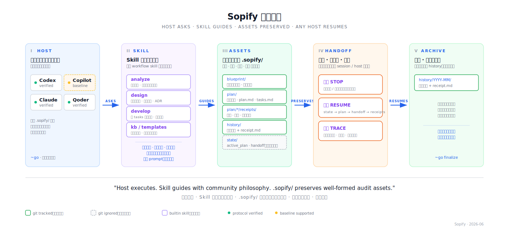

# Sopify

<div align="center">

**可恢复的 AI 编程 — 先问再写，方案跟着项目走**

[](./LICENSE)
[](./LICENSE-docs)
[](#版本历史)
[](./CONTRIBUTING_CN.md)

[](#快速开始)
[](#快速开始)
[](#快速开始)
[](#快速开始)

[English](./README.md) · 简体中文 · [快速开始](#快速开始) · [贡献者](./CONTRIBUTORS.md)

</div>

<div align="center">

</div>

---

AI 工具写代码很快。但在事实没搞清、关键决策还没拍板前就直接动手，快就会变成返工。Sopify 是 AI 编程的开发过程协议层：在托管流程里，需求不全或决策未定时，宿主会先追问，再写代码。

Sopify 把方案和验证收据保存在 `.sopify/` 中，作为可纳入 git 的项目文件；只有恢复用的本地指针不进 git。在同一个仓库中，明确说“继续”或使用 `~go`，任一受支持的宿主都可以读取这些文件，从上次停点恢复托管任务。

无需新编辑器、无需新 CLI。安装到你已有的宿主：Codex、Claude、Qoder、Copilot 均支持。

**设计原则：**

- **不确定就停下** — 需求不全时先追问，再动手
- **随时恢复** — 方案和验证收据都持久保存在 `.sopify/` 里；换宿主、换机器、换人接手都能从项目状态继续
- **决策留痕** — 方案、取舍、审查持久保存在 `.sopify/`

**Sopify 主要在防什么：**

- **过早开写** — 关键信息没补齐、关键决策没拍板，AI 就直接改代码
- **接力断档** — 一换宿主、换机器、换人接手，就得重新解释上下文
- **决策失忆** — 重要取舍留在聊天里，没沉淀成项目资产

[查看工作流图、checkpoint 与恢复流程 →](./docs/how-sopify-works.md)

## 实战演示

<p align="center">
  
</p>

## 快速开始

```bash
curl -fsSL https://github.com/evidentloop/sopify/releases/latest/download/install.sh | bash -s -- --target codex:zh-CN
```

Sopify 需要 Python 3.11 或更高版本；安装器会在下载前检查。这条命令只安装
Sopify。[EvidentLoop](https://github.com/evidentloop/evidentloop) 是一个可选的代码变更
审计工具：它把本地 Git diff 变成可交互、可反馈的 HTML 报告，审计问题可回链到
具体修改行；Sopify 可将这份报告作为方案审计证据。若要同时安装本次 Sopify 发布
验证过的版本，或复用已有兼容组件，在命令末尾加 `--with-evidentloop`；不加时，
安装器不会探测或安装它。

安装后用 `~go` 启动全托管工作流。审查优先安装、其他宿主和 Windows 请看[安装说明](#安装说明)。

**已在 Sopify 管理的仓库里？** 明确说“继续”或使用 `~go`，即可恢复当前方案。普通问答和小范围修改会按当前请求直接处理，不会自动进入之前的方案流程。

## 为什么选择 Sopify？

**需求不清楚时，它会停下来。**
你说"加个缓存"。Sopify 不急着动手——先分析需求、设计方案、拆分任务，把讨论结果沉淀到 `.sopify/plan/` 里。方案确认后才写代码，改的每一行都有据可查。

<div align="center">

</div>

**你的队友可以直接接手。**
你在 Codex 里开始一个功能，完成了设计和两个任务。下周队友打开同一个仓库的 Claude，输入 `~go`。Sopify 读取 checkpoint，从任务 3 继续——不用写交接文档，不用重新交代上下文。

<div align="center">

</div>

**每个决策都留有痕迹。**
一个月后，有人问为什么缓存 key 里带了用户 ID。答案在 `.sopify/plan/` 里——触发这个决策的需求、设计它的方案、通过它的审查，一应俱全。

<div align="center">

</div>

## 产品形态

<div align="center">

</div>

宿主 LLM 负责执行。Sopify 把 AI 开发过程中的审计资产——方案、决策、交接、验证证据——持久保留在 `.sopify/` 中，跨 session、宿主和团队成员均可访问。

Sopify 靠四件事做到稳定可控、质量可靠：

- **每个宿主同一套规则** — Claude、Codex、Qoder、Copilot 加载的是同一套 Sopify 指令，切换宿主不会把流程重置
- **项目资产在 git 里** — 方案、决策、验证记录都落在 `.sopify/`；只有两个本地指针文件（`active_plan.json`、`current_handoff.json`）不纳入 git
- **按你的指令继续** — 明确说“继续”或使用 `~go` 后，宿主会读取当前方案、上次交接记录和已有验证证据，再继续执行
- **Runtime 已退场；工作流保留** — analyze → design → develop → finalize 流程不变；变的是规则活在文件里，不再依赖 runtime 进程

## 架构细节

想了解产品形态背后的内部层次，可以看下面的技术结构图。

<div align="center">

</div>

## 安装说明

审查优先安装：

```bash
curl -fsSL -o sopify-install.sh https://github.com/evidentloop/sopify/releases/latest/download/install.sh
less sopify-install.sh          # 审查后再执行
bash sopify-install.sh --target codex:zh-CN
```

Windows PowerShell：

```powershell
iwr https://github.com/evidentloop/sopify/releases/latest/download/install.ps1 -OutFile sopify-install.ps1
Get-Content sopify-install.ps1 | more
.\sopify-install.ps1 --target codex:zh-CN
```

宿主支持：

| 宿主 | Tier | Target | 说明 |
|------|------|--------|------|
| Codex | PROTOCOL_VERIFIED | `codex:zh-CN` / `codex:en-US` | 全能力接续 |
| Claude | PROTOCOL_VERIFIED | `claude:zh-CN` / `claude:en-US` | 全能力接续 |
| Qoder | PROTOCOL_VERIFIED | `qoder` | 已在 Qoder CLI 验证 |
| Copilot | BASELINE_SUPPORTED | `copilot:zh-CN` / `copilot:en-US` | 仅 prompt；payload 升级计划中 |

可用 `--workspace <path>` 指定目标仓库，`--language <lang>` 控制输出语言。

快速开始里的可选参数也适用于审查后执行：

```bash
bash sopify-install.sh --target codex:zh-CN --with-evidentloop
```

CLI 安装给当前用户；Skill 使用宿主支持的目录：Codex 为
`$HOME/.agents/skills/evidentloop/`，Claude 为 `$HOME/.claude/skills/evidentloop/`，
Qoder 为 `$HOME/.qoder/skills/evidentloop/`，Copilot 为当前项目的
`<workspace>/.github/skills/evidentloop/`。已有组件通过兼容检查后复用；Sopify 不声明
它们与固定来源完全相同。不兼容组件保持原样。Copilot 目录属于你的项目，Sopify
不会自动提交或更新。前置条件和本地/云端边界见
[Getting Started](./docs/getting-started.md#optional-evidentloop-companion)。

完整设置指南见 [Getting Started](./docs/getting-started.md)。分步 demo 见 [External Repo Quickstart](./examples/external-repo-quickstart/README.md)。

## 命令参考

| 命令 | 说明 |
|-----|------|
| `~go` | 自动判断并执行完整流程（有活动 plan 时自动恢复执行） |
| `~go plan` | 只规划不执行 |
| `~go finalize` | 收口当前活动方案 |

普通用户只需要记住 `~go / ~go plan`；维护者验证命令放在 [贡献指南](./CONTRIBUTING_CN.md)。

## 配置说明

```bash
cp examples/sopify.config.yaml ./sopify.config.yaml
```

```yaml
brand: auto
language: zh-CN

workflow:
  mode: adaptive   # strict | adaptive | minimal
  require_score: 7

```

## 目录结构

```text
sopify/
├── scripts/               # 安装、诊断与维护脚本
├── examples/              # 配置示例
├── docs/                  # 工作流指南与开发者参考
├── sopify_writer/         # 协议资产写入库
├── sopify_contracts/      # schema 定义与共享数据结构
├── skills/                # prompt-layer 源码
├── installer/             # 宿主适配器与安装编排
└── .sopify/               # 项目协议根目录
    ├── blueprint/         # 协议规范、设计基线与削减目标
    ├── plan/              # 活跃方案 + receipts
    └── history/           # 已归档方案 + receipts
```

完整工作流、checkpoint 和知识库层级说明见 [工作流说明](./docs/how-sopify-works.md)。

## 版本历史

- 详细变更记录见 [CHANGELOG.md](./CHANGELOG.md)

## 许可证

- 代码与配置：Apache 2.0，见 [LICENSE](./LICENSE)
- 文档：CC BY 4.0，见 [LICENSE-docs](./LICENSE-docs)

## 贡献

提交用户可见行为改动时，建议同步更新 `README.md` / `README.zh-CN.md`，并参考 [CONTRIBUTING_CN.md](./CONTRIBUTING_CN.md) 执行校验。
