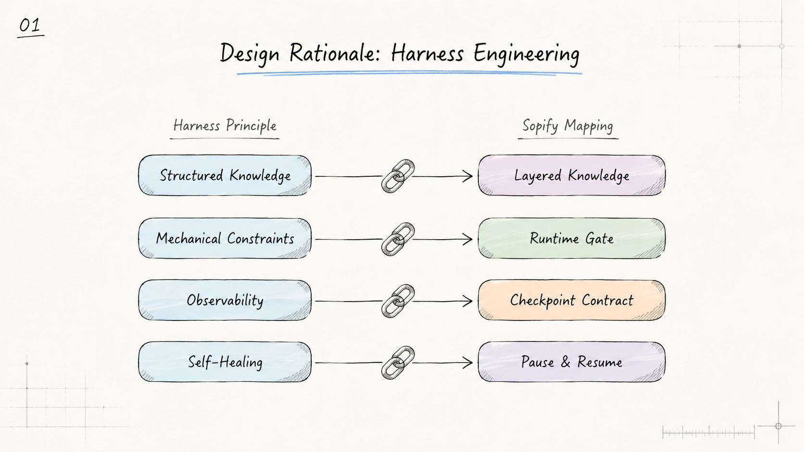
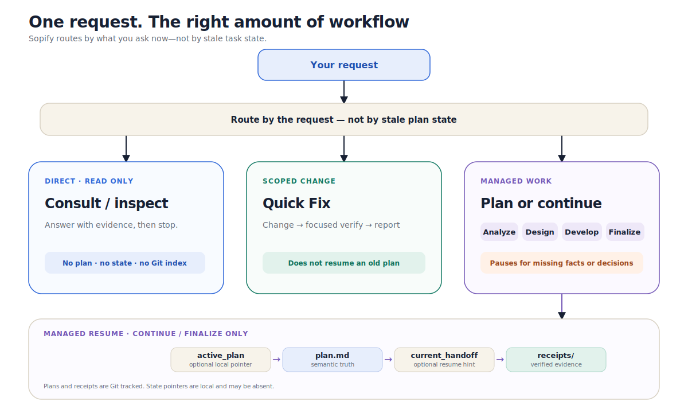
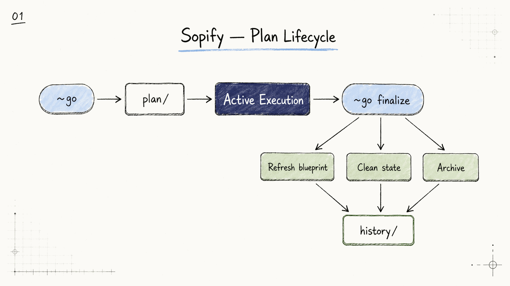

# How Sopify Works

## Design Rationale: Harness Engineering

Sopify borrows harness engineering ideas, but does not use them as the repository's homepage identity. This section explains design rationale, not product positioning.

> **Note:** The diagram below shows the original design inspiration. Some concepts (e.g. "runtime gate") have been retired in the current architecture — see [Core Value](#core-value-auditable-ai-development-assets) and [Protocol Entry](#protocol-entry-4-step-read-chain) for the current model.

<div align="center">

</div>

Official reference: [`Harness engineering: leveraging Codex in an agent-first world`](https://openai.com/index/harness-engineering/)

## Core Value: Auditable AI Development Assets

Sopify preserves the **process** of AI development — plans, decisions, handoffs, execution evidence, and archival records — as traceable assets. Cross-session and cross-host continuation is the natural result of these assets being portable and verifiable.

The host (Codex, Claude, Qoder, Copilot) executes. Sopify ensures every decision leaves a trace that survives session boundaries, host switches, and team handoffs.

**Runtime retired; workflow retained.** The analyze → design → develop → finalize workflow is unchanged. What changed is that workflow rules now live in protocol files and host prompt assets, not in a runtime process.

## Main Workflow

<div align="center">

</div>

Workflow notes:

- The host reads protocol entry instructions from its prompt asset (installed via `install.sh --target <host>`)
- Before entering managed plan / continuation / finalize, the host follows a 4-step read chain: `state/active_plan.json` → `plan/<id>/plan.md` → `state/current_handoff.json` → `plan/<id>/receipts/`
- Consult and quick-fix requests do **not** auto-continue the active plan
- Stale or invalid state does not interrupt ordinary questions; it is handled only when the user enters a managed-plan action
- State writes go through `sopify_writer` (the only write path for protocol assets)

### Checkpoint Pause and Resume

The workflow includes two canonical checkpoint types:

- `answer_questions` — collects missing facts before a formal plan is materialized
- `confirm_decision` — resolves design branches before resuming execution

Both are expressed through `current_handoff.required_host_action`, not separate state files.

## Protocol Entry (4-Step Read Chain)

When the host detects `.sopify/` and the user request targets managed plan / continuation / finalize:

```
1. state/active_plan.json     → locate plan_id (if missing → consult / new-plan)
2. plan/<id>/plan.md          → semantic entry: goals + progress (truth source)
3. state/current_handoff.json → resume hint + whether waiting for user
4. plan/<id>/receipts/        → latest 1-3 receipts (what's been verified)
```

**Design principle**: read `plan.md` first for semantic truth, then `current_handoff` as a resume hint. The handoff is never a second truth source; `active_plan.json` stores only `plan_id`, while wave and task progress stay in plan files. A complete plan is identified by `plan_version`; standard tasks and architecture design both participate in that version. MCP may aggregate these facts, but it is not required for protocol entry.

**If state files are missing** (e.g. fresh clone on a new machine): `active_plan.json` and `current_handoff.json` are gitignored by design. The host browses `plan/` for candidates only when the user starts, continues, or finalizes managed work; an ordinary question never auto-resumes an old plan. Plans and receipts are always in git — only the "where am I right now" pointer is local.

### Optional Verifiers

Sopify does not install or run a verifier by default. Sopify alone, another verifier, and an independently installed EvidentLoop are all valid paths. `--with-evidentloop` is an explicit install convenience, not a runtime switch: new components use EvidentLoop's current official sources, while healthy existing components are reused without automatic upgrades. EvidentLoop owns compatibility; Sopify does not maintain a version matrix, remove components, or track installation state. The Copilot Skill is project-owned content in `.github/skills/evidentloop/`; users review and commit it when needed, and Sopify does not commit or update it. Installation proves local placement and health only; Skill discovery and audit E2E still require host evidence, and cloud agents do not inherit the locally installed CLI.

Independent audits do not need a plan binding. A formal plan-wide audit may live in `audits/plan/`, while focused audits may use `audits/<scope>/`; the host writes a receipt only when the user adopts the result as formal evidence. `audits/` is not part of the default 4-step read chain.

## Directory Structure and Layers

```text
.sopify/
├── blueprint/                   # L1 long-lived blueprint (git tracked)
│   ├── README.md
│   ├── background.md
│   ├── design.md
│   ├── tasks.md
│   └── protocol.md
├── plan/                        # L2 active plans (git tracked)
│   └── <plan_id>/
│       ├── plan.md              # sole semantic entry
│       ├── tasks.md             # optional (standard+)
│       ├── design.md            # optional (architecture level)
│       ├── audits/              # optional audit reports; not read by default
│       └── receipts/            # execution/verification evidence
├── history/                     # L3 archived plans (git tracked)
│   ├── index.md
│   └── YYYY-MM/
├── state/                       # protocol state (gitignored, 2 files only)
│   ├── active_plan.json         # current plan pointer
│   └── current_handoff.json     # resume hint + required_host_action
├── user/
│   ├── preferences.md
│   └── feedback.jsonl
├── sopify.json                  # workspace activation marker
└── project.md                   # project conventions
```

Layer notes:

- `blueprint/` stores durable knowledge, protocol spec, and stable contracts
- `plan/` stores active work packages with process audit assets (receipts)
- `history/` stores finalized plans with archival receipts
- `state/` is the minimal protocol state layer — only 2 files, always gitignored

## Host Support

| Host | Tier | Install Command | Notes |
|------|------|-----------------|-------|
| Codex | PROTOCOL_VERIFIED | `install.sh --target codex:en-US` | Full capability continuation |
| Claude | PROTOCOL_VERIFIED | `install.sh --target claude:en-US` | Full capability continuation |
| Qoder | PROTOCOL_VERIFIED | `install.sh --target qoder` | Validated on Qoder CLI |
| Copilot | BASELINE_SUPPORTED | `install.sh --target copilot` | Prompt-only; payload uplift planned |

## Appendix: Plan Lifecycle

<div align="center">

</div>

This appendix is maintainer-oriented; most users only need the main workflow.
