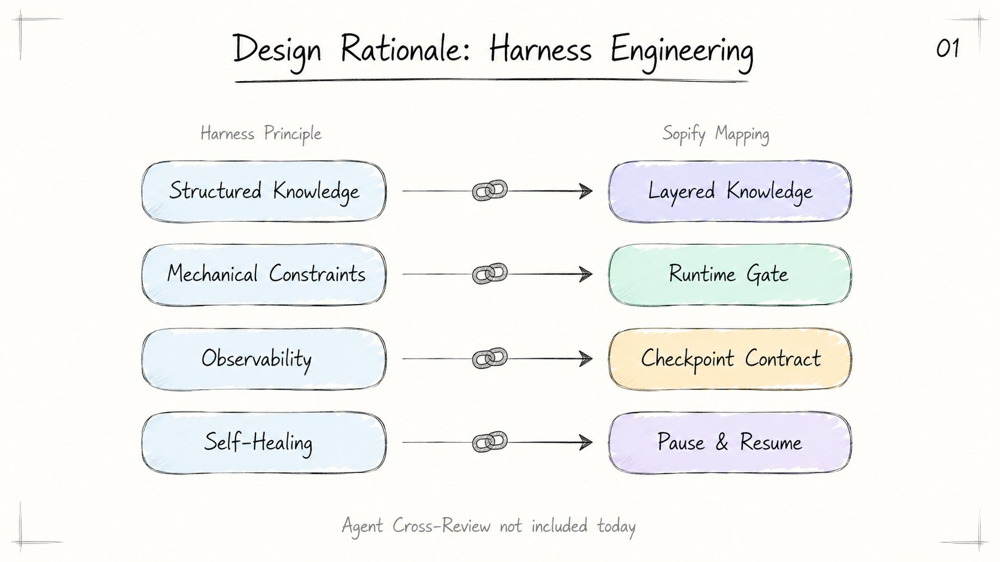
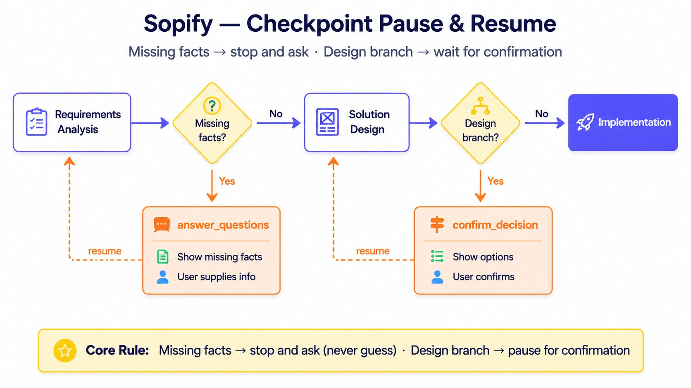
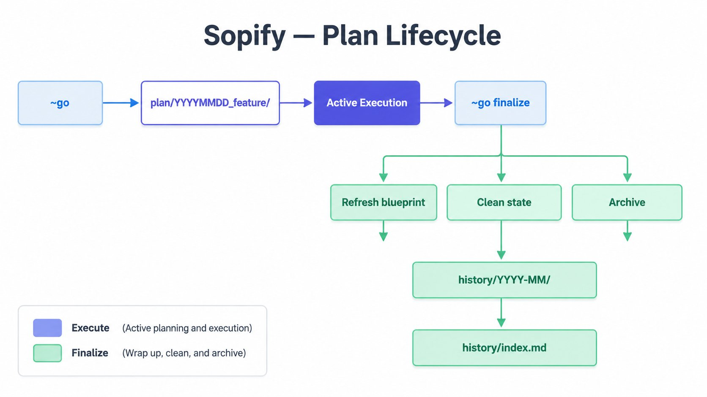

# How Sopify Works

## Design Rationale: Harness Engineering

Sopify borrows harness engineering ideas, but does not use them as the repository's homepage identity. This section explains design rationale, not product positioning.

<div align="center">

</div>

Official reference: [`Harness engineering: leveraging Codex in an agent-first world`](https://openai.com/index/harness-engineering/)

## Main Workflow

<div align="center">

</div>

Workflow notes:

- Every Sopify turn enters through runtime gate first
- Only code tasks go through complexity routing
- The standard host loop follows handoff contracts instead of guessing from `Next:`

## Checkpoint Pause and Resume

<div align="center">

</div>

Checkpoint rules:

- `answer_questions` collects missing facts before a formal plan is materialized
- `confirm_decision` resolves design branches before resuming the default runtime entry

## Directory Structure and Layers

```text
.sopify-skills/
├── blueprint/                   # L1 long-lived blueprint (git tracked)
│   ├── README.md
│   ├── background.md
│   ├── design.md
│   └── tasks.md
├── plan/                        # L2 active plans (git tracked)
│   ├── _registry.yaml           # local machine registry (still ignored)
│   └── YYYYMMDD_feature/
├── history/                     # L3 archived plans (git tracked)
│   ├── index.md
│   └── YYYY-MM/
├── state/                       # runtime machine truth (always ignored)
│   ├── current_handoff.json
│   ├── current_run.json
│   ├── current_decision.json
│   ├── current_gate_receipt.json
│   ├── last_route.json
│   └── sessions/<session_id>/...   # parallel review isolation
├── user/
│   ├── preferences.md
│   └── feedback.jsonl
└── project.md
```

Layer notes:

- `blueprint/` stores durable knowledge and stable contracts
- `plan/` stores active work packages, not long-lived blueprint state; the directory is tracked, but `_registry.yaml` remains locally ignored
- `history/` stores closed-out plans and is tracked
- `state/` is the local runtime data layer ignored by git

## Appendix: Plan Lifecycle

<div align="center">

</div>

This appendix is maintainer-oriented; most users only need the main workflow.
